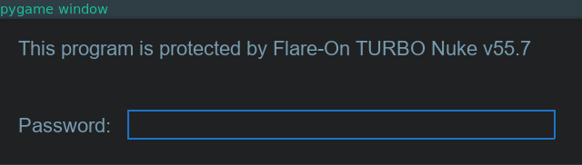
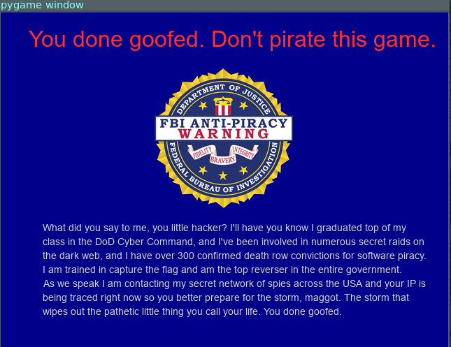
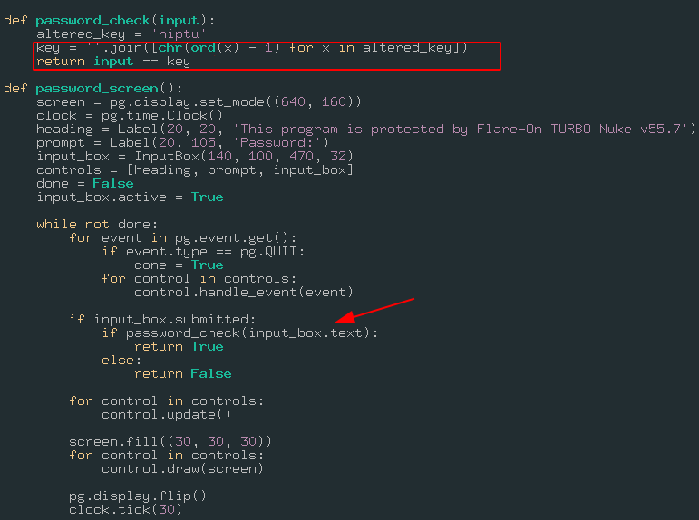
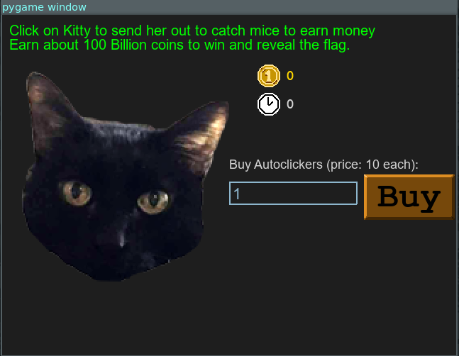
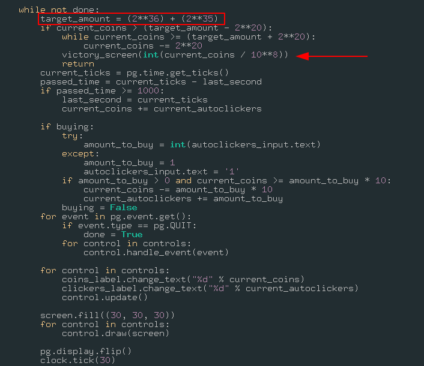

# Fidler 01

Message:

```
Welcome to the Seventh Flare-On Challenge!

This is a simple game. Win it by any means necessary and the victory screen will reveal the flag. Enter the flag here on this site to score and move on to the next level.

This challenge is written in Python and is distributed as a runnable EXE and matching source code for your convenience. You can run the source code directly on any Python platform with PyGame if you would prefer.

*7zip password: flare
```

## Running the game

### Password screen



If you enter anything here, you will get this screen





Now, let's take a look at the password validation code



Looks like a simple ROT1 encoding, so to find out the password, you can replicate the key line

```python
>>> altered_key = 'hiptu'
>>> key = ''.join([chr(ord(x)-1) for x in altered_key])
>>> key
'ghost'
```

Now you can enter the decoded key, and you will get this screen:




So, looks like a click game, we should reach 100 Billion coins in order to get our flag. Let's analyse the game logic



As told to us, if we reach a certain number, the flag will appear, actually the number isn't 100 Billion always, we can see that the target_amount is, ***2^36 + 2^35 = 103079215104***, if our number will be greater, we can also beat this game, because our number will be fixed to the correct one.


### Beating: The cryptosystem

Now it's easy to beat the game, let's analyse the decrypt logic:

```python
def decode_flag(frob):
    last_value = frob
    encoded_flag = [1135, 1038, 1126, 1028, 1117, 1071, 1094, 1077, 1121, 1087, 1110, 1092, 1072, 1095, 1090, 1027,
                    1127, 1040, 1137, 1030, 1127, 1099, 1062, 1101, 1123, 1027, 1136, 1054]
    decoded_flag = []

    for i in range(len(encoded_flag)):
        c = encoded_flag[i]
        val = (c - ((i%2)*1 + (i%3)*2)) ^ last_value
        decoded_flag.append(val)
        last_value = c

    return ''.join([chr(x) for x in decoded_flag]
 ```

 This is a simple XOR encryption, but the fun part is, Only the first char is encrypted with the number we sent, all the other parts is using the last value as key, so with our first key we decrypt the fisrt index, the second index will use the first index as value.

So, the only thing that matter here is decode the first char!

### Beating: Loading as library

In python we can load any script as library, we can call this ***fidler.py***, like:

```python
>>> import fidler
>>> flag = fidler.decode_flag(int(103079215104 /10**8))
>>> flag
'idle_with_kitty@flare-on.com' # << flag
>>> wrong_key = fidler.decode_flag(3223)
>>> wrong_key
'ࣸdle_with_kitty@flare-on.com'
```
As you can see, even with the wrong key, the cryptosystem will still give us a part of the flag, because it uses the last index value as key, and the first index, 0, use the "frob" to decrypt itself.
