# Garbage - 02


Message:
```
One of our team members developed a Flare-On challenge but accidentally deleted it. We recovered it using extreme digital forensic techniques but it seems to be corrupted. We would fix it but we are too busy solving today's most important information security threats affecting our global economy. You should be able to get it working again, reverse engineer it, and acquire the flag.
```

So it's provided to us a corrupted PE file and we must make this executable works again, the most fun parte of this challenge was be able to use my own tools, I ended using [quickpe](https://github.com/AandersonL/quickpe/) and my x64dbg plugin [ASLR-Removal](https://github.com/AandersonL/x64dbg-ASLR-Removal).

Let's start

## Recon

So before run this file in a Windows env, let's get some file information, I will run quickpe for that

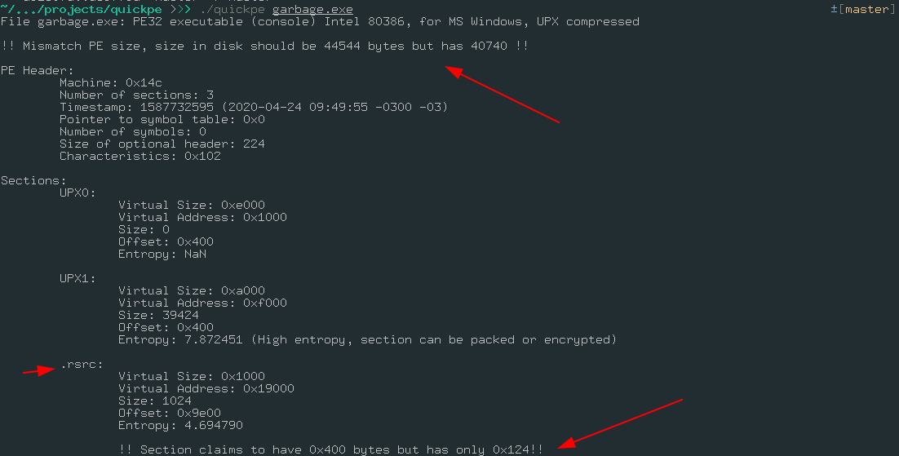

So, we have two very useful output here, the PE file size is incorrect and the ***.rsrc***(resource) section is incomplete (this two information I implemented while I was resolving this CTF), So first things first.


## PE size mismatch

Let's take a look at the PE structure

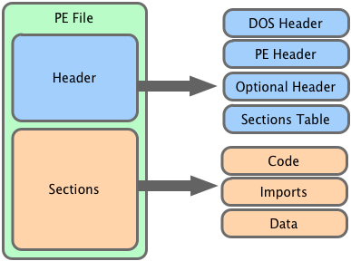

The PE file is defined by a header and sections, in the header part of the PE we find information about the executalble itself, this information is used by the OS loader when you are executing this file in some way. In order to get the PE size, we just need to sum the Header + Sections, this will give the raw size that this file should have.

## Resource: the missing point

Something is missing in ***.rsrc*** section, let's take a look into his contents, I will use [radare2](https://www.radare.org/r/) for that.

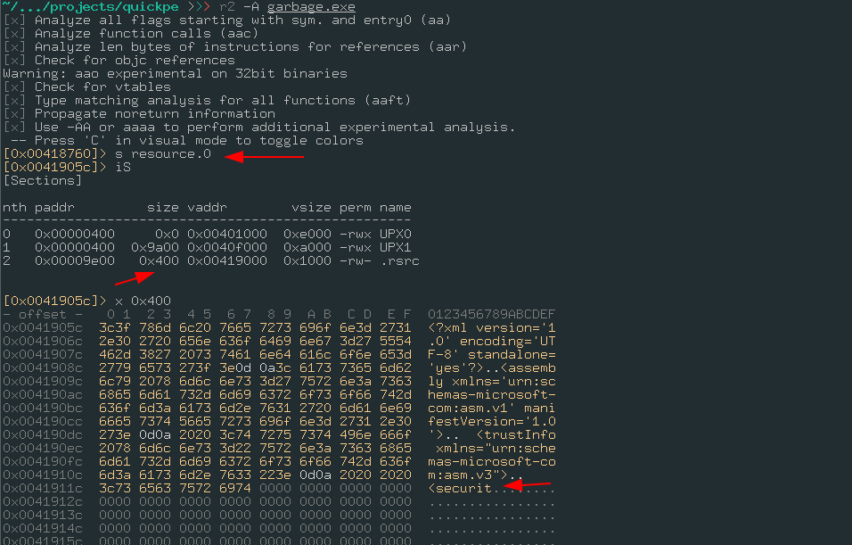


So, what is missing here is a part of the [Windows Manifests file](https://docs.microsoft.com/en-us/windows/win32/sbscs/application-manifests), we can complete this XML string try to execute that, right? 

```
>>> echo  "y>                                                                     
    </security>                      
  </trustInfo>   
</assembly>" >> garbage.exe
```

And then

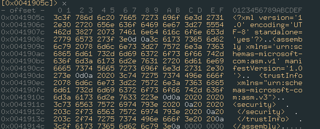


Let's try run that on Windows right now


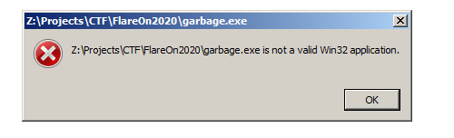

The file still corrupt, let's try to unpack this file using upx (the packer used)

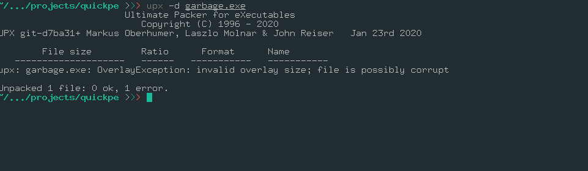

So, we get this error ***OverlayException***, when this happen it means that this PE file has more data (or less in this case), that it should be.


## Fixing size

Let's fix the size of this file, first we get the size that this file size should be minus the file size that it has righ now, ***44544-40740=3804***, let's just add a bunch of 0x00 bytes in the end of the file to fill the gap in the resource section.

> dd if=/dev/zero count=3804 bs=1 >> garbage.exe

After fix it'size, let's look at quickpe output:

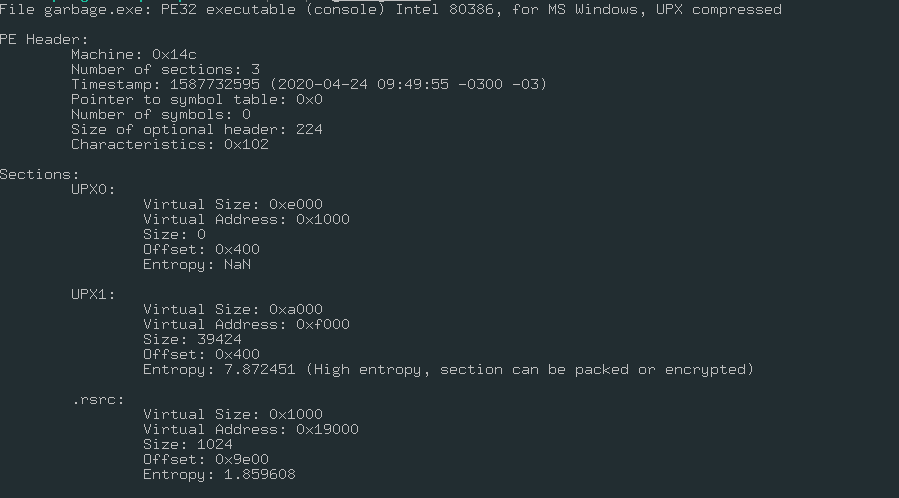

No error detect, now we can unpack using upx :) 

```
 upx -d garbage.exe                                                                                 
                       Ultimate Packer for eXecutables
                          Copyright (C) 1996 - 2020
UPX git-d7ba31+ Markus Oberhumer, Laszlo Molnar & John Reiser   Jan 23rd 2020

        File size         Ratio      Format      Name
   --------------------   ------   -----------   -----------
     82432 <-     44544   54.04%    win32/pe     garbage.exe

Unpacked 1 file.
```


Running on Windows:

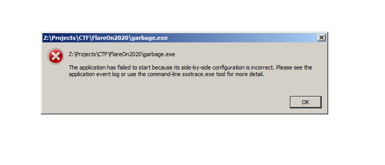

Great, another error, but this error is different than the other one because here the windows actually loaded our binary! Let's debug this application error using ***sxstrace.exe***, this tool trace for any windows events and generate a more detailed log file instead the Event viewer.


Here is the error parsed:

```
-----------------
INFO: Parsing Manifest File Z:\Projects\CTF\FlareOn2020\garbage.exe.
	INFO: Manifest Definition Identity is (null).
	ERROR: Line 3: XML Syntax error.
ERROR: Activation Context generation failed.
End Activation Context Generation.
```

Our manifest is incorrectly, but guess so ? I really don't care, windows should be able to run this file without this manifest! So what I did was, change the number of resource directories to 0 using [CFF Explorer](https://ntcore.com/?page_id=388), doing that the Windows loader will think that this file has no resource at all!

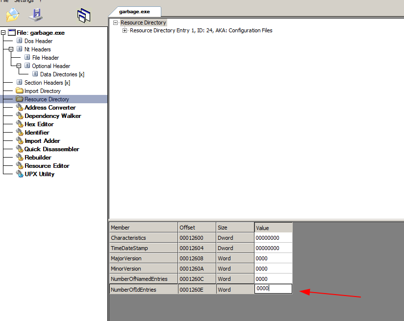


Now let's run that again!

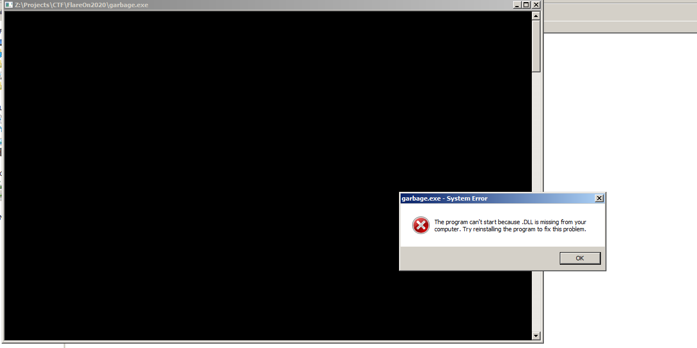


Almost there, looks like the loader isn't finding the DLL's that this file needed, if we look to imported libraries, all the importated functions is using their [ordinal values](https://docs.microsoft.com/en-us/archive/msdn-magazine/2002/march/inside-windows-an-in-depth-look-into-the-win32-portable-executable-file-format-part-2)

## Fixing modules import names

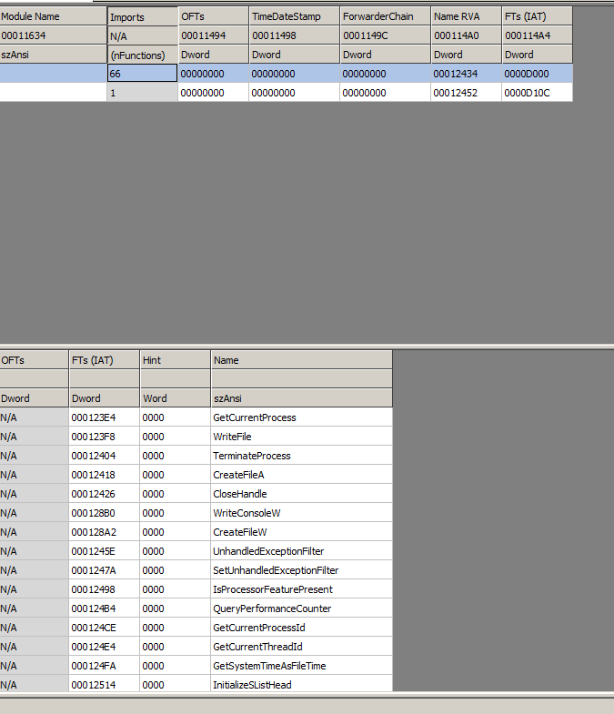


So, here we have only the functions names (Decoded by CFF explorer using their ordinal numbers), using this imports name it's easy to deduce that this function come from ***kernel32.dll*** , and the next module only import  ***ShellExecuteA*** function, wich comes from ***shell32.dll***.

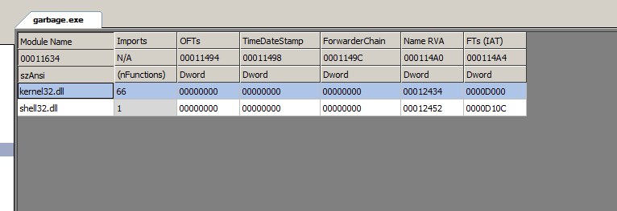


After fix, let's finally run our PE file!


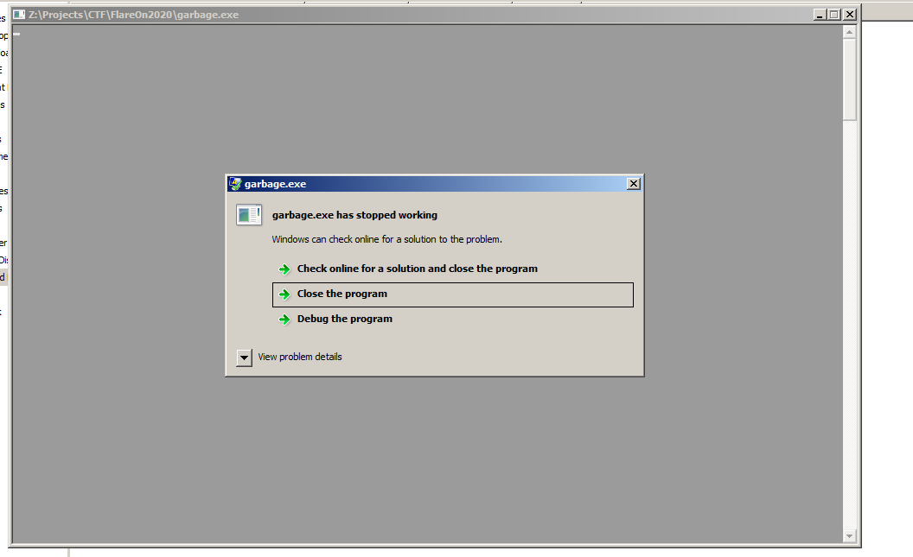


At this time, I was like [that](https://www.youtube.com/watch?v=AwY4pzb0Pjs), what can be happening right now!?

## Debugging with x64dbg

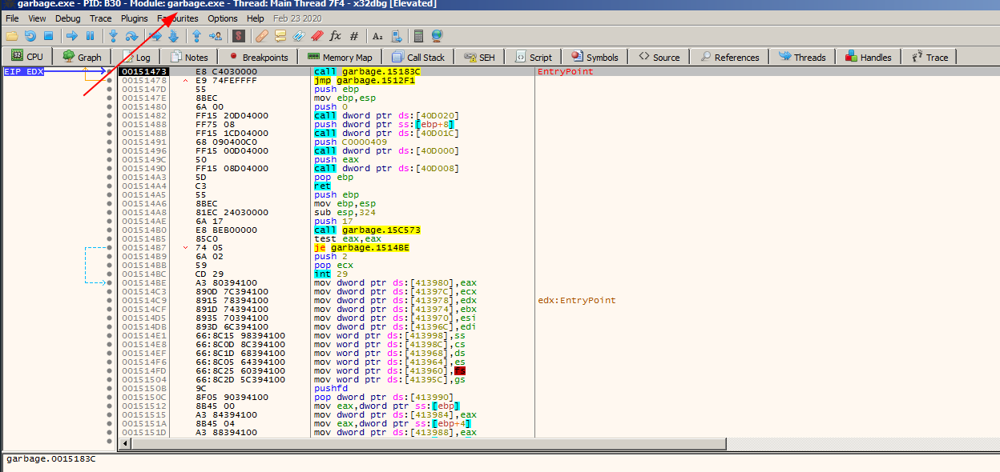

The arrow above shows that our file was actually loaded in memory and it's really executing! So I put a breaking point at the entrypoint of this binary, and wait to the first instruction be executed to see what error really happned!

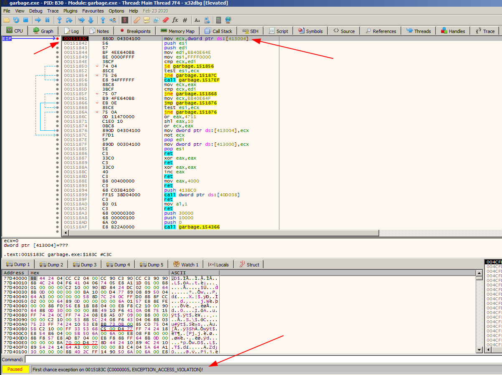


What happened here ?

The instruction tried to access the address ***0x413004*** which don't belong to our current memory virtual address, our addresses are are being randomly generated by [ASLR](https://en.wikipedia.org/wiki/Address_space_layout_randomization), that's why our process is crashing, this will probably compiled without ASLR, and somehow my unpack process added that.


## Disable ASLR using my plugin

That was very unexpected, I had written a [plugin](https://github.com/AandersonL/x64dbg-ASLR-Removal) to remove that in x64dbg a couple weeks ago, so I just used him for this task.

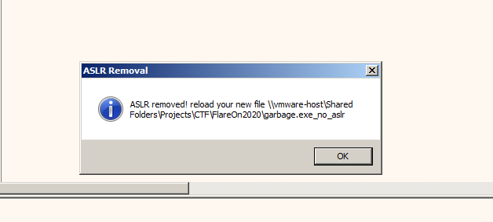

## Finally, the flag

Lets run the patched file


Actually, the binary drops an vbs file named ***sink_the_tanker.vbs*** which contains this MessageBox.


It took 3-4 days to solve this challenge, I'm really happy to be able to acomplish this using my tools in the process and the bunch of knowledge that I put on practice.

thanks.