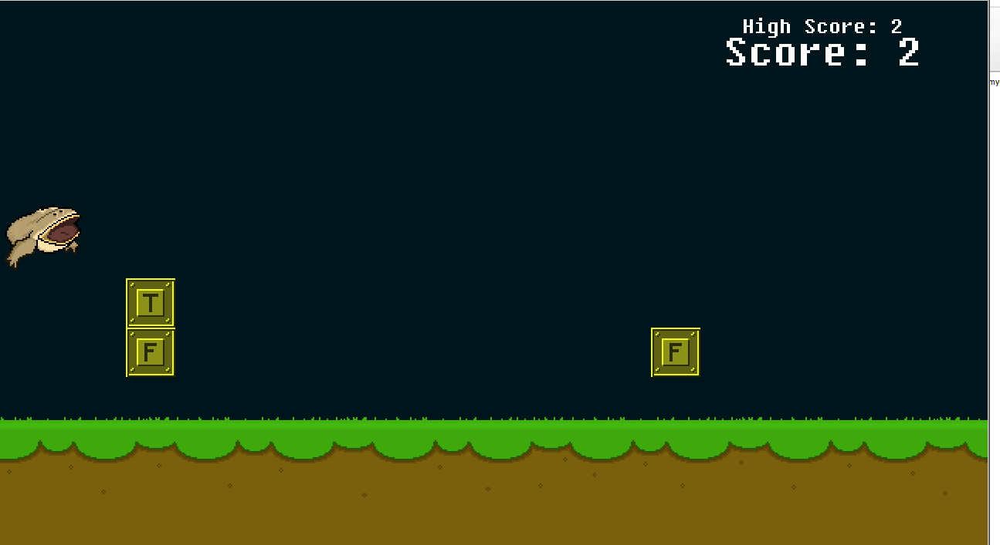
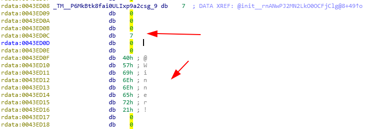
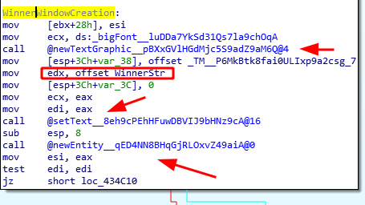
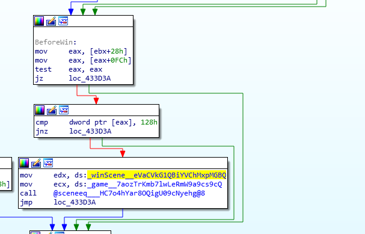
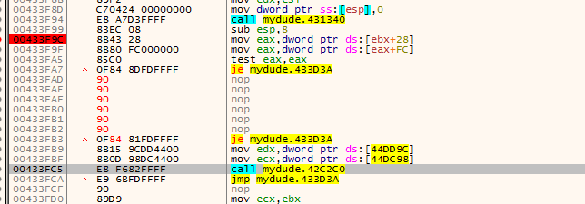
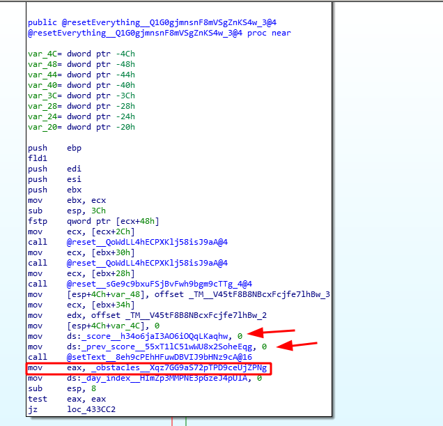
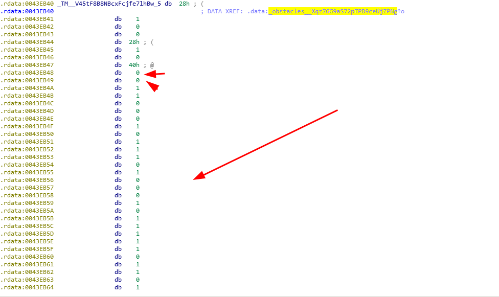
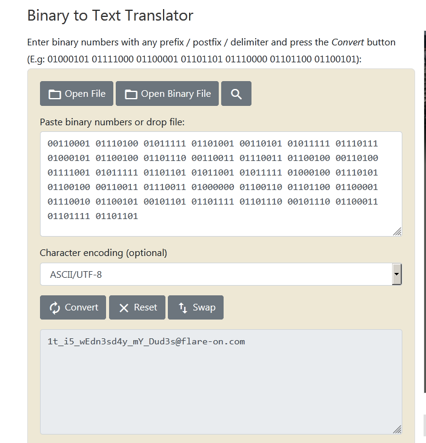

# Wednesday - 03


Message:
```
Be the wednesday. Unlike challenge 1, you probably won't be able to beat this game the old fashioned way. Read the README.txt file, it is very important.
```

Ok, that one was very trick and take me about 4-5 days to solve, so let's start


## Recon

### Meme

Well, this is actually a [meme](https://knowyourmeme.com/memes/it-is-wednesday-my-dudes), at the start I tought that this has something to do with the flag, but it's not, it's just a joke.


### Library

The first thing that came into my attention was that this is a [SDL](https://www.libsdl.org/) game, this library give us low level access to audio, keyboard, windows and etc.

### Language

The language that this is written is [NIM](https://nim-lang.org/), I know that based on their symbol names:

```
$ rabin2 -s mydude.exe
....
369  0x0001ae60 0x0041ba60 GLOBAL FUNC 0                 @nimgame2_audioDatInit000@0
```

### Gameplay



The idea here it's simple, if has F (friday) in the block we must jump, if has M(Monday) we must duck, just that simple.


## Deep down with IDA

I used mostly IDA for this challenge (I used radar2/Cutter and x64dbg too, but I solve mostly with IDA and python).

### The Win function


After a lot of time doing static analysis in this game, I found the Winner string definition, here is how it's stored:



In NIM, the strings actually starts 6 bytes before, because it must define the string size, note that at address ***0x0043E0C*** has the number 7, that is the length of the string itself, "Winner!".

So, at the beginner of this string definition, it has a XREF to the ***init*** function, take a look:



Here it's build the Win scene, note that it's loaded some kind of ***big font*** and then it's called the function ***@newTextGraphic***, after that the WinnerStr is loaded and it's created a newEntity in memory that hold this data.


And, how this winscene is called ? taking a deep look at the ***update*** function, I realized that the winscene is called when we reach 296(0x128) points.




In other words, if we jump all obstacles (296) we must win the game, right?

## Patching with x64dbg


Knowing that, I did a in memory patch using x64dbg:




And then, as expected:


***Of course this will not be so easy, huh?***

## Dive into Game hacking


Ok, we know that the deal it's not beat the game, but I want to try win the game even knowing that.

## Obstacles definition

After a while, I found a interesting function, ***resetEverything***




So, here is where the game initialize every piece of data, you can see that our score is set to 0 and the prev_score(high score) too, but take a look at the ***_obstacles__*** structure, lets peek into that:



So that is when the obstacles are defined, I tested this sequence and really works, here is how this vector is used:

* We hold a day index
* If the current value in this vector is 0, we duck
* Else we jump
* If our day index is in the end of this vector, we win

Simple as that, so my game hacking idea was:

* Dump this vector in disk
* Load in python
* Create a simple array of actions
* Use pyautogui to play for me


## Dumping with IDA


In IDA it's very simple to dump data using IDC scripting, so here is the script I used to dump the raw vector into disk


```
auto fname      = "dump_mem.bin";
auto address    = 0x0043EB48;
auto end        = 0x0043EC6F;

auto file= fopen(fname, "wb");

savefile(file, 0, address, (end+1)-address);
fclose(file);
```

After that, I loaded this dump into my auto play script:

```python
import pyautogui
import time

OBSTACLES_MEM_DUMP = "Z:/Projects/CTF/FlareOn2020/3_-_wednesday/wednesday/dump_mem.bin"

obstacles_raw = None

with open(OBSTACLES_MEM_DUMP, "rb") as dump:
    obstacles_raw = dump.read()

actions = ["down" if obs == 0 else "up" for obs in obstacles_raw]


WAIT = 2
print("Will start to playin {} seconds, please move the cursor to DUDE button".format(WAIT))
time.sleep(WAIT)


pyautogui.click()
time.sleep(0.7)

long_obstacle = 2.6
SPACE_FIRST = 1.3
SECOND_SPACE = 0.6

print("LET'S GO MY DUDES!")
time.sleep(long_obstacle)

long_obstacle -= SECOND_SPACE
incr = 0
for i in range(0, len(actions), 2):
    first_action = actions[i]
    second_action = actions[i+1]

    pyautogui.keyDown(first_action)
    time.sleep(SPACE_FIRST)
    pyautogui.keyUp(first_action)

    pyautogui.keyDown(second_action)
    time.sleep(long_obstacle)
    pyautogui.keyUp(second_action)
```

And guess what ? It actually works, I play for ~220 points, until... I hit.
My Windows machine was having some fps problems and the timing that I calculated just failed, so yeah, you have to admit that this was a very crazy idea that is obvius that will never work, but I wanted to try.


## Getting the flag


You saw all my failures here, but here is how I beat.

After take I deep breath and give this challenge a time, I started again and took a look into this vector structure, it's is a bunch of 1's ands 0's, just like...binary encoded data, I took the raw dump into my python console, and splited for 8 chars each and pasted at a random binary conversor


```
>>> splited = [out[i:i+n] for i in range(0, len(out), n)]
>>> splited
['00110001', '01110100', '01011111', '01101001', '00110101', '01011111', '01110111', '01000101', '01100100', '01101110',
 '00110011', '01110011', '01100100', '00110100', '01111001', '01011111', '01101101', '01011001', '01011111', '01000100',
 '01110101', '01100100', '00110011', '01110011', '01000000', '01100110', '01101100', '01100001', '01110010', '01100101',
 '00101101', '01101111', '01101110', '00101110', '01100011', '01101111', '01101101']
>>>open('code','w').write(' '.join(splited))
```

And here is:




This make me very crazy, It was so simple and was in front of me all this time, but that's the good part of this, all the road until I realize that this obstacles vector with 1's and 0's was the encoded flag make me learn a lot of things, and you must admit that this was very a trick challenge.


Thanks!


