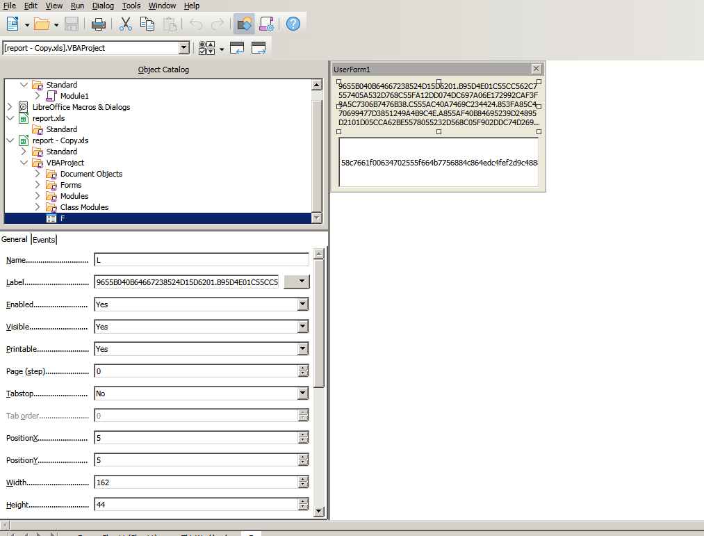
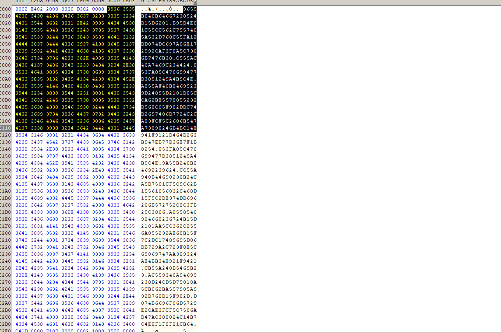
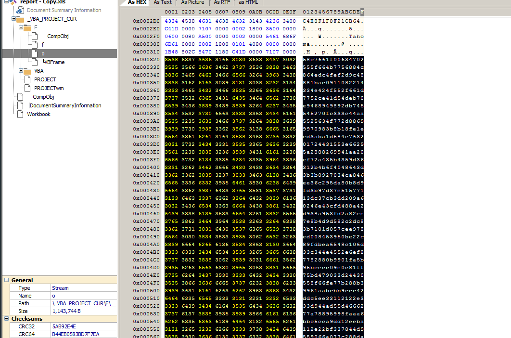
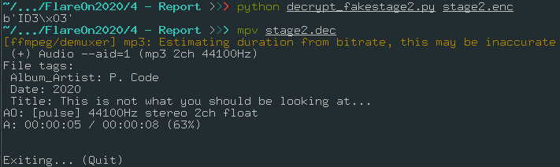
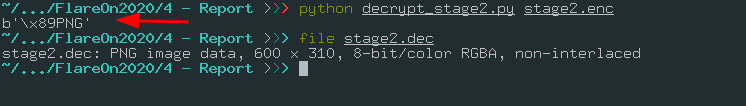

# Report - 4

Message

```
Nobody likes analysing infected documents, but it pays the bills. Reverse this macro thrill-ride to discover how to get it to show you the key.
```


In this challenge we need to analyse a malicious xls document that contain a malicious macro and make use modern and advanced techniques.


# Recon

xls documents are defined in [OLE](https://docs.microsoft.com/en-us/cpp/mfc/ole-background?view=vs-2019) format, that format store documents, "folder" and bytes streams, its mainly used for documents like, docx, xls and others.

I will use [oletools](https://securityonline.info/oletools/) to get some internal file informations, such all the streams and VBA projects inside this document, before open the document itself.

## oledump 

We can use oledump to get all the streams in the OLE file (document)

```
Z:\Projects\CTF\FlareOn2020\report>oledump.py -v report.xls
  1:       108 '\x01CompObj'
  2:       244 '\x05DocumentSummaryInformation'
3:    352240 'Workbook'
4:        97 '_VBA_PROJECT_CUR/F/\x01CompObj'
  5:       284 '_VBA_PROJECT_CUR/F/\x03VBFrame'
  6:       163 '_VBA_PROJECT_CUR/F/f'
  7:   1143744 '_VBA_PROJECT_CUR/F/o'
  8:       534 '_VBA_PROJECT_CUR/PROJECT'
  9:        68 '_VBA_PROJECT_CUR/PROJECTwm'
 10: m    1388 '_VBA_PROJECT_CUR/VBA/F'
 11:     10518 '_VBA_PROJECT_CUR/VBA/Sheet1'
 12: M    1785 '_VBA_PROJECT_CUR/VBA/ThisWorkbook'
 13:      4327 '_VBA_PROJECT_CUR/VBA/_VBA_PROJECT'
 14:      3345 '_VBA_PROJECT_CUR/VBA/__SRP_0'
 15:       486 '_VBA_PROJECT_CUR/VBA/__SRP_1'
 16:       592 '_VBA_PROJECT_CUR/VBA/__SRP_2'
 17:       140 '_VBA_PROJECT_CUR/VBA/__SRP_3'
 18:      3158 '_VBA_PROJECT_CUR/VBA/__SRP_4'
 19:       473 '_VBA_PROJECT_CUR/VBA/__SRP_5'
 20:       448 '_VBA_PROJECT_CUR/VBA/__SRP_6'
 21:        66 '_VBA_PROJECT_CUR/VBA/__SRP_7'
 22:       827 '_VBA_PROJECT_CUR/VBA/dir'
 ```

 We can see that we have VBA code at 10 and 12 streams, denoted by letter ***M***, let's dump that:

 ```
 Z:\Projects\CTF\FlareOn2020\report>oledump.py -v report.xls -v -e -s10
Attribute VB_Name = "F"
Attribute VB_Base = "0{4CAFACAA-2A4D-41F3-9B86-24F5964089BB}{A9F6A711-2CEB-4939-941D-EAC47AFB9092}"
Attribute VB_GlobalNameSpace = False
Attribute VB_Creatable = False
Attribute VB_PredeclaredId = True
Attribute VB_Exposed = False
Attribute VB_TemplateDerived = False
Attribute VB_Customizable = False

Z:\Projects\CTF\FlareOn2020\report>oledump.py -v report.xls -v -e -s 12
Attribute VB_Name = "ThisWorkbook"
Attribute VB_Base = "0{00020819-0000-0000-C000-000000000046}"
Attribute VB_GlobalNameSpace = False
Attribute VB_Creatable = False
Attribute VB_PredeclaredId = True
Attribute VB_Exposed = True
Attribute VB_TemplateDerived = False
Attribute VB_Customizable = True
Sub Workbook_Open()
Sheet1.folderol
End Sub

Sub Auto_Open()
Sheet1.folderol
End Sub
```

The function above run when the document is opened.

```VB
Sub Workbook_Open()
Sheet1.folderol
End Sub
```


But the oledump was very vague here, we just know that something called ***Sheet1.folderol*** is being called when the macro run, let's dump the whole code using ***olevba***

## Olevba

```
olevba report.xls > output
```
That give to us a lot of useful information about the VB code inside, but I will stick in ***Sheet1*** code, because it's where the function ***folderol*** is found.


```VB
Private Declare Function InternetGetConnectedState Lib "wininet.dll" _
(ByRef dwflags As Long, ByVal dwReserved As Long) As Long

Private Declare PtrSafe Function mciSendString Lib "winmm.dll" Alias _
   "mciSendStringA" (ByVal lpstrCommand As String, ByVal _
   lpstrReturnString As Any, ByVal uReturnLength As Long, ByVal _
   hwndCallback As Long) As Long

Private Declare Function GetShortPathName Lib "kernel32" Alias "GetShortPathNameA" _
    (ByVal lpszLongPath As String, ByVal lpszShortPath As String, ByVal lBuffer As Long) As Long

Public Function GetInternetConnectedState() As Boolean
  GetInternetConnectedState = InternetGetConnectedState(0&, 0&)
End Function

Function rigmarole(es As String) As String
    Dim furphy As String
    Dim c As Integer
    Dim s As String
    Dim cc As Integer
    furphy = ""
    For i = 1 To Len(es) Step 4
        c = CDec("&H" & Mid(es, i, 2))
        s = CDec("&H" & Mid(es, i + 2, 2))
        cc = c - s
        furphy = furphy + Chr(cc)
    Next i
    rigmarole = furphy
End Function

Function folderol()
    Dim wabbit() As Byte
    Dim fn As Integer: fn = FreeFile
    Dim onzo() As String
    Dim mf As String
    Dim xertz As Variant
    
    onzo = Split(F.L, ".")
    
    If GetInternetConnectedState = False Then
        MsgBox "Cannot establish Internet connection.", vbCritical, "Error"
        End
    End If

    Set fudgel = GetObject(rigmarole(onzo(7)))
    Set twattling = fudgel.ExecQuery(rigmarole(onzo(8)), , 48)
    For Each p In twattling
        Dim pos As Integer
        pos = InStr(LCase(p.Name), "vmw") + InStr(LCase(p.Name), "vmt") + InStr(LCase(p.Name), rigmarole(onzo(9)))
        If pos > 0 Then
            MsgBox rigmarole(onzo(4)), vbCritical, rigmarole(onzo(6))
            End
        End If
    Next
        
    xertz = Array(&H11, &H22, &H33, &H44, &H55, &H66, &H77, &H88, &H99, &HAA, &HBB, &HCC, &HDD, &HEE)

    wabbit = canoodle(F.T.Text, 0, 168667, xertz)
    mf = Environ(rigmarole(onzo(0))) & rigmarole(onzo(1))
    Open mf For Binary Lock Read Write As #fn
      Put #fn, , wabbit
    Close #fn
    
    mucolerd = mciSendString(rigmarole(onzo(2)) & mf, 0&, 0, 0)
End Function

Function canoodle(panjandrum As String, ardylo As Integer, s As Long, bibble As Variant) As Byte()
    Dim quean As Long
    Dim cattywampus As Long
    Dim kerfuffle() As Byte
    ReDim kerfuffle(s)
    quean = 0
    For cattywampus = 1 To Len(panjandrum) Step 4
        kerfuffle(quean) = CByte("&H" & Mid(panjandrum, cattywampus + ardylo, 2)) Xor bibble(quean Mod (UBound(bibble) + 1))
        quean = quean + 1
        If quean = UBound(kerfuffle) Then
            Exit For
        End If
    Next cattywampus
    canoodle = kerfuffle
End Function

```

In folderol function, we see that the function Split is being called with the VBName F, and access F.T, but F macro is shown as empty, let's investigate:


### Strings in forms

The ***F*** variable is a reference to a VBA form, you can see that is a simple user interface with encoded and encrypted data, take a look




I also used [ssviewer](https://www.mitec.cz/ssv.html) to interpret the ole file itself, and I found in the stream ***o*** the same data in the form.




Here we can see that we have some encoded data divided by "***.***", this will give us a list of encoded strings, and each time that the malware wants to access an string, it calls the  ***rigmarole*** function, this function get the string in hex representation, and subtract the second byte for the first, jumping 2 bytes each time.


Rigmarole function:

```VB
Function rigmarole(es As String) As String
    Dim furphy As String
    Dim c As Integer
    Dim s As String
    Dim cc As Integer
    furphy = ""
    For i = 1 To Len(es) Step 4
        c = CDec("&H" & Mid(es, i, 2))
        s = CDec("&H" & Mid(es, i + 2, 2))
        cc = c - s
        furphy = furphy + Chr(cc)
    Next i
    rigmarole = furphy
End Function
```

Now we ca just split the same way that the malware do and run the same decode algorithm, here is the decode algorithm in python:


```python
from pprint import pprint

def decode_string(encoded_string):
	out = ""
	for s in range(0, len(encoded_string), 4):
		c = int(encoded_string[s:s+2], base=16)
		s = int(encoded_string[s+2:s+4], base=16)

		cc = c - s
		out += chr(cc)

	return out	


if __name__ == '__main__':
	encoded_values =  "9655B040B64667238524D15D6201.B95D4E01C55CC562C7557405A532D768C55FA12DD074DC697A06E172992CAF3F8A5C7306B7476B38.C555AC40A7469C234424.853FA85C470699477D3851249A4B9C4E.A855AF40B84695239D24895D2101D05CCA62BE5578055232D568C05F902DDC74D2697406D7724C2CA83FCF5C2606B547A73898246B4BC14E941F9121D464D263B947EB77D36E7F1B8254.853FA85C470699477D3851249A4B9C4E.9A55B240B84692239624.CC55A940B44690238B24CA5D7501CF5C9C62B15561056032C468D15F9C2DE374DD696206B572752C8C3FB25C3806.A8558540924668236724B15D2101AA5CC362C2556A055232AE68B15F7C2DC17489695D06DB729A2C723F8E5C65069747AA389324AE4BB34E921F9421.CB55A240B5469B23.AC559340A94695238D24CD5D75018A5CB062BA557905A932D768D15F982D.D074B6696F06D5729E2CAE3FCF5C7506AD47AC388024C14B7C4E8F1F8F21CB64".split(".")
	
	decoded_values = []
	for encoded in encoded_values:
		decoded_values.append(decode_string(encoded))
	
	
	for i,v in enumerate(decoded_values):
		print("decoded_table[{}] = {}".format(i, v))	
)

```

This will give to us what I called, decoded_table, with this decoded strings it's possible to interpret the code using the plain text strings.

```
 python decode_strings.py
decoded_table[0] = AppData
decoded_table[1] = \Microsoft\stomp.mp3
decoded_table[2] = play 
decoded_table[3] = FLARE-ON
decoded_table[4] = Sorry, this machine is not supported.
decoded_table[5] = FLARE-ON
decoded_table[6] = Error
decoded_table[7] = winmgmts:\\.\root\CIMV2
decoded_table[8] = SELECT Name FROM Win32_Process
decoded_table[9] = vbox
decoded_table[10] = WScript.Network
decoded_table[11] = \Microsoft\v.png
]
```

Now, let's just continue to read the script and when the malware call the decode string function, we just look at our decoded table.


### The evade system


In the code below, we can see that the malware has a simple evade system, I already decoded all the ***ringmarole*** calls for the real string value.

```VB
 Set fudgel = "winmgmts:\\.\root\CIMV2"
 Set twattling = fudgel.ExecQuery("SELECT Name FROM Win32_Process")

For Each p In twattling
    Dim pos As Integer
    pos = InStr(LCase(p.Name), "vmw") + InStr(LCase(p.Name), "vmt") + InStr(LCase(p.Name), "vbox")
    If pos > 0 Then
        MsgBox rigmarole("Sorry, this machine is not supported", vbCritical, "Error")

        End
    End If
Next
```

In order words, this code makes a [wmi](https://docs.microsoft.com/en-us/windows/win32/wmisdk/wmi-start-page) query to get all running process, and then, if some process contain any trace that is in the virtualized enviroment, an alert box will appear.


## Fake Stage 2 extraction

Using the decode table we can see when the second stage is dropped:


```vb
# key ?
xertz = Array(&H11, &H22, &H33, &H44, &H55, &H66, &H77, &H88, &H99, &HAA, &HBB, &HCC, &HDD, &HEE)

wabbit = canoodle(F.T.Text, 0, 168667, xertz)
mf = Environ("AppData") & "\Microsoft\stomp.mp3"

Open mf For Binary Lock Read Write As #fn
    Put #fn, , wabbit
Close #fn

mucolerd = mciSendString("play" &  mf, 0&, 0, 0)
```

So, the stage 1 will drop a file with ***.mp3*** extension, and use the [mciSendString](https://docs.microsoft.com/en-us/previous-versions/dd757161(v=vs.85)) function to "play" that song, now we need to get the ***F.T.Text*** value and understand how the decryption process in ***canoodle*** function works.


## The two faces of L


The function that decrypt the song is that:

```VB
Function canoodle(panjandrum As String, ardylo As Integer, s As Long, bibble As Variant) As Byte()
    Dim quean As Long
    Dim cattywampus As Long
    Dim kerfuffle() As Byte
    ReDim kerfuffle(s)
    quean = 0
    For cattywampus = 1 To Len(panjandrum) Step 4
        kerfuffle(quean) = CByte("&H" & Mid(panjandrum, cattywampus + ardylo, 2)) Xor bibble(quean Mod (UBound(bibble) + 1))
        quean = quean + 1
        If quean = UBound(kerfuffle) Then
            Exit For
        End If
    Next cattywampus
    canoodle = kerfuffle
End Function
```


This can be easily rewritten in Python as:

```python
def decrypt_stage(stage2, pos, key, length):
	decrypted = []
	len_key = len(key)
	key_count = 0

	for i in range(0, len(stage2), 4):
		byte_at = int(stage2[i+pos:i+2+pos], base=16)
		b = byte_at ^ key[key_count % len_key]
		
		decrypted.append(b)
		key_count += 1

		if key_count == length:
			break

	return bytes(decrypted)
```

The idea here is, we get a text, a length and where in the string we should split, because this will be a text in the hex format, and we just will decrypt the first byte of this 2 bytes, example:

```
b = "C4BA"
b[0+pos:2] ^ key# C4
```

This is also using a XOR encryption using an block cipher, so we need to always make sure to stay in the range, using mod.


## Decrypting the audio

Just like before, I dumped the data using [ssviewer](https://www.mitec.cz/ssv.html), I edited the file to make it start at the ***58*** value, the start of ***L.Text***(Look at the form again).




Now, calling the function:

```python
key = b"\x11\x22\x33\x44\x55\x66\x77\x88\x99\xAA\xCC\xDD\xEE"

input_file = sys.argv[1]

stage2_decrypted = open(input_file, "r").read().strip()
size = 	168667
decrypted_stage2 = decrypt_stage(stage2_decrypted, 0, key, size)

    
with open("stage2.dec", "wb") as sfd:
    print(decrypted_stage2[:4])
    sfd.write(decrypted_stage2)
```

I get this sound:




The sound has only a random sounds, and the title is ***This is not what you should be looking at...*** and the Album title is ***P. Code***.

Again...you did not think that will be so easy, huh ?

## Let's talk about the real thing here


Ok, forget about almost everything above, the real thing is... that this code above is fake.


# VBA Stomping

After research a lot about [P-Code](https://en.wikipedia.org/wiki/P-code_machine), I discovered that VBA macros,  actually are compiled when the document is ready and not only hold the real code, but the compiled code. This way makes the execute process faster if the person who open the document has the same VBA version.

That "feature" can be used to inject malicious code inside the document and write a fake source file to trick analysts and anti virus solutions, if the document has the same VBA version as the attacker, this code will be executed and using that is possible to hide the real code, this technique is called [VBA Stomping](https://vbastomp.com/).

We can dump the real P-Code with the amazing job created by [Dr. Vesselin Bontchev](https://github.com/bontchev) the author of [pcodedmp](https://github.com/bontchev/pcodedmp), using this we can read the original source code. The P-Code has a format that remember ASM, so in order to get the almost exactly code as the macro, I found this another cool tool based in pcodedmp, [pcode2code](https://github.com/Big5-sec/pcode2code).


## The real source


Let's use ***pcodedmp*** and get the real code:

>  pcode2code report.xls | tee real_code.vbs

I will not dump the whole code again, because only certain things changed, the decrypt and decode table still the same, so we will use our previous work to get the flag.


```VB
' Already decoded the strings looking at our decode table
Set groke = CreateObject("WScript.Network")
firkin = groke.UserDomain
If firkin <> "FLARE-ON" Then
    MsgBox "Sorry, this machine is not supported." vbCritical, "Error"
    End
End If

n = Len(firkin)
For i = 1 To n
    buff(n - i) = Asc(Mid$(firkin, i, 1))
Next

wabbit = canoodle(F.T.Text, 2, 285729, buff)
mf = Environ("AppData" & "\Microsoft\v.png")
Open mf For Binary Lock Read Write As #fn
' a generic exception occured at line 68: can only concatenate str (not "NoneType") to str
'	# Ld fn
'	# Sharp
'	# LitDefault
'	# Ld wabbit
'	# PutRec
Close #fn

Set panuding = Sheet1.Shapes.AddPicture(mf, False, True, 12, 22, 600, 310)
```


What has changed here?

* It get the hostname and check if is equal to FLARE-ON
* The FLARE-ON name is reversed and its created an buff with their numbers values, in ascii
* The byte used to decrypt is in the second position
* The length of the output file is greater
* The key is the reversed FLARE-ON string


Very cool, isn't ?

# Finally, the real flag

Now, its just a matter to adapt the script to decrypt for us:

```python
if __name__ == '__main__':
	# FLARE-ON
	# key = "FLARE-ON" 
	key = b"\x4e\x4f\x2d\x45\x52\x41\x4c\x46" # reversed

	input_file = sys.argv[1]

	stage2_decrypted = open(input_file, "r").read().strip()
	size = 	285730
	decrypted_stage2 = decrypt_stage(stage2_decrypted, 2, key, size)
	
		
	with open("stage2.dec", "wb") as sfd:
		print(decrypted_stage2[:4])
		sfd.write(decrypted_stage2
```

And then:



The decrypted flag image is


That was very cool, I really like how this CTF makes the players research and create new things to solve real world problems and not be stucked in the same CTF challenges styles.


Thanks.