# TKApp - 5

Message:

```
Now you can play Flare-On on your watch! As long as you still have an arm left to put a watch on, or emulate the watch's operating system with sophisticated developer tools.
```

As you can see, that challenge explore an smart watch application.


# Recon


The filename provided to us is called ***TKApp.tpk***, at first looks like a normal ***APK*** file, but before extract this archive, I search to this ***.tpk*** files, that extension is from ***Tizen Package***, [Tizen](https://www.tizen.org/ko?langredirect=1) it's an OS with focused in SmartTV's and smart watchs, it can be easily develop by using the Tizen SDK and the application are mostly written using [Xamarin](https://dotnet.microsoft.com/apps/xamarin), that uses .NET.

## Extraction

As archive files like ***apk*** are just zip files, we can easily extract using ***unzip*** and look their internals.

```
$ ls                                                                                
author-signature.xml  bin  lib  res  shared  signature1.xml  tizen-manifest.xml  TKApp.deps.json
```

What matter here is the bin folder, inside that folder we can find the ***dll*** of our app, called ***TKApp.dll***, now it's very easy to continue, we just need to open this ***dll*** in some .NET decompiler, for this challenge I used mostly DotPeek from Jetbrains, but there is other very good decompilers like, [dnSpy](https://github.com/0xd4d/dnSpy) that has a very good assembly editor to create patchs, but I just needed to understand the entire application code before, I prefer [DotPeek](https://www.jetbrains.com/decompiler/) for that.


## Emulation enviroment

You need to download Tizen Studio and the Emulator manager in order to run this app in a emulated watch.

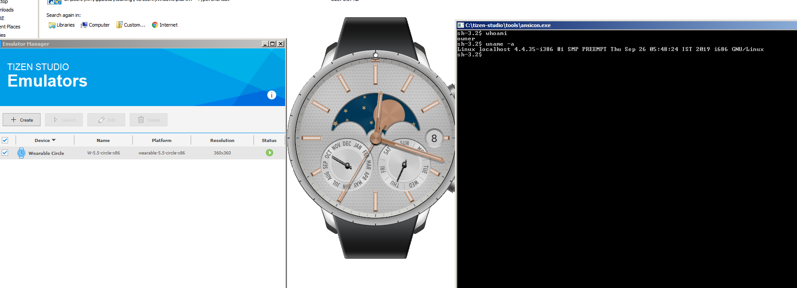

After tha App installation, you will get a unlock screen:


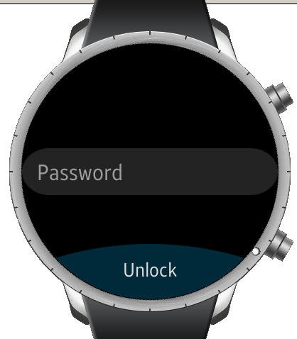


Now that we have our emulator and decompiler ready, It's time to begin the real fun.


## DotPeek


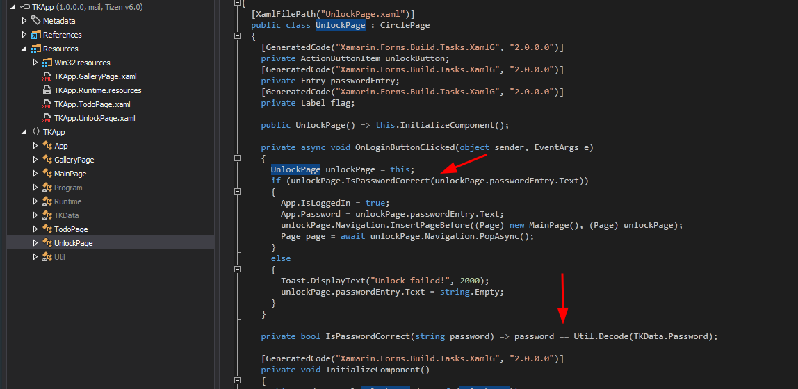

So, in order to unlock that page, we must get the password that are stored in ***TKData*** and pass that to a ***Util.Decode*** function, let's take a look at the password and the decode function.


```C#
public static byte[] Password = new byte[9]
{
    (byte) 62,
    (byte) 38,
    (byte) 63,
    (byte) 63,
    (byte) 54,
    (byte) 39,
    (byte) 59,
    (byte) 50,
    (byte) 39
};
```
Decode:

```C#
public static string Decode(byte[] e)
{
    string str = "";
    foreach (byte num in e)
    str += Convert.ToChar((int) num ^ 83).ToString();
    return str;
}
```

You can get the raw value of the encoded password password with this simple python snippet


```python
>>> password = [62,38,63,63,54,39,59,50,39]
>>> ''.join([chr(p) for p in password])
">&??6';2'"
>>> ''.join([chr(p^83) for p in password])
'mullethat'
```

You can now enter ***mullethat*** and go to the main screen


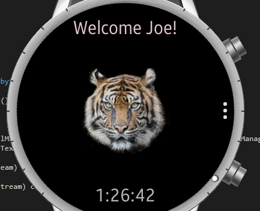


## What I have TODO now ?

In this app, has two options, a ***TODO*** page and a ***Image gallery***, if you go to ***todo*** page, you will get a simple task, ***Go Home***


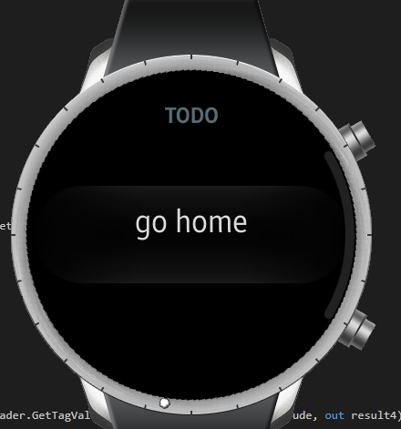

### Going home


If we take a look at ***checkHome*** function at ***TodoPage*** class, we get this code.


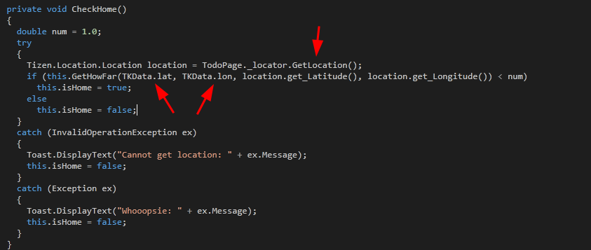


In other words, the application know where is his home, if we take a look at ***TKData*** class, we get this code from ***GetCoordinates***:

```C#
...
double[] coordinates = TKData.GetCoordinates(Path.Combine(Application.get_Current().get_DirectoryInfo().get_Resource(), "gallery", "04.jpg"));
...
public static double[] GetCoordinates(string imageFileName)
{
    using (ExifReader exifReader = new ExifReader(imageFileName))
    {
    string result1 = "";
    string result2 = "";
    double[] result3;
    double[] result4;
    if (!exifReader.GetTagValue<double[]>(ExifTags.GPSLatitude, out result3) || !exifReader.GetTagValue<double[]>(ExifTags.GPSLongitude, out result4) || (!exifReader.GetTagValue<string>(ExifTags.GPSLatitudeRef, out result1) || !exifReader.GetTagValue<string>(ExifTags.GPSLongitudeRef, out result2)))
        return new double[2];
    double num1 = result4[0] + result4[1] / 60.0 + result4[2] / 3600.0;
    double num2 = result3[0] + result3[1] / 60.0 + result3[2] / 3600.0;
    return new double[2]
    {
        (result1.StartsWith("N") ? 1.0 : -1.0) * num2,
        (result2.StartsWith("E") ? 1.0 : -1.0) * num1
    };
    }
}
```


So the location information is in the [exif](https://en.wikipedia.org/wiki/Exchangeable_image_file_format) metadata in the image ***04.jpg***, let's get this coordinates using ***exiftool***

```
$ exiftool 04.jpg
...
Megapixels                      : 0.281
Thumbnail Image                 : (Binary data 10217 bytes, use -b option to extract)
GPS Latitude                    : 34 deg 37' 30.72" N
GPS Longitude                   : 97 deg 12' 42.12" W
Date/Time Created               : 2020:06:22 16:37:53-16:37
Date/Time Original              : 2020:06:22 16:37:53-16:37
GPS Position                    : 34 deg 37' 30.72" N, 97 deg 12' 42.12" W
```

I place the latitude and longitude value in this [site](https://www.gps-coordinates.net/) and inject a fake location unsing the Tizen tools.


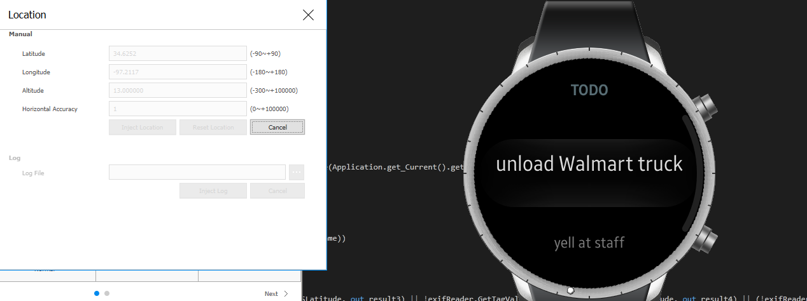

That unlocked more tasks, but don't worry, you don't need unload a walmart truck to beat that.


## Unlocking the tiger


Now, in the ***MainPage*** class, take a look at this big function:

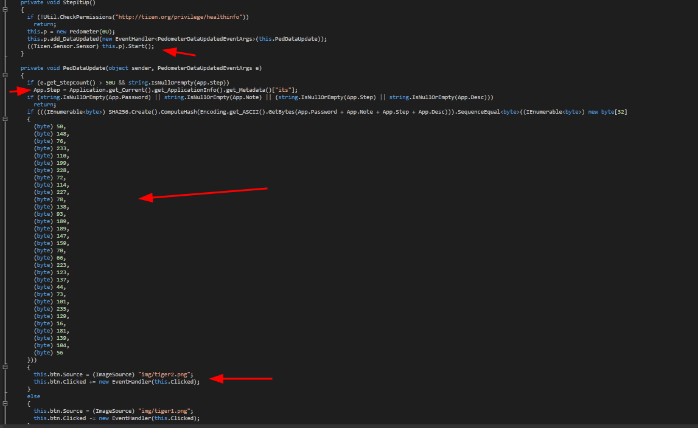


Let's in parts:

* It start the [pedometer](https://en.wikipedia.org/wiki/Pedometer) sensor update
* It check if you already give 50 steps or more
* If you already walk that, It will get an metadata in the application XML with the key "its"
* It will now sum the following values: ***App.Password + App.Note + App.Step + App.Desc*** and get a SHA256 hash 
* If this hash match, it will replace the current tiger image from another and add a handler function to that tiger


So now, we just need to understand how the application will load this values and force this hash check be correct.

## Hunting the hash pieces

## Notes

The App.Note variable is easily found in ***TODO*** class, at here:


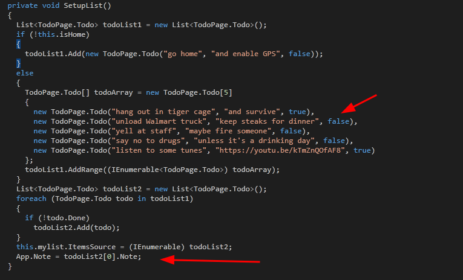

So, we already have this value, it's just a matter to solve the first TODO task, go home :)


## Desc


The App.Desc is assign when we look at a particular image in the gallery.

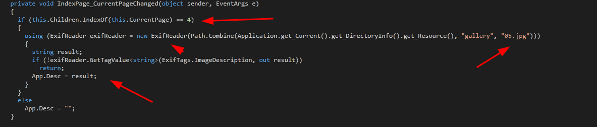

Now, we must just go to the index 4 in the gallery image, ***Remember, the index 4 is the last image***.

## Step

So as seen in the code before, we just need to walk 50 steps, for this, I will start the pedometer emulator in the Control panel from Tizen.


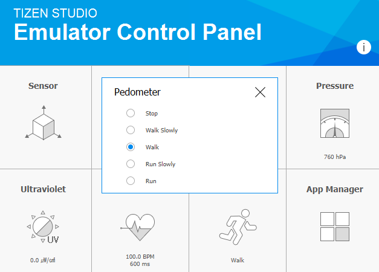

And when we hit 50 steps, the application will load the following value from the Manifest XML.

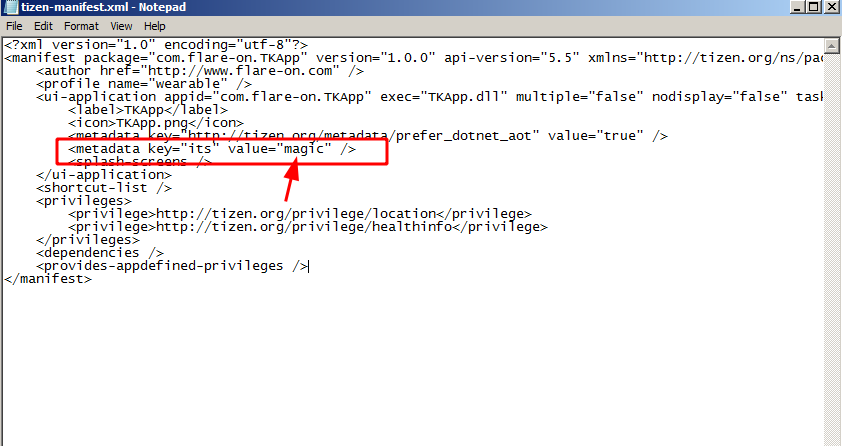


# Making this work


So we must be at the last image, after fix the location and walk 50 steps to beat this, just enable the pedometer and wait a little, after that open the image and hit the back button in the application (To not reset the current image index that are updated everytime you change the image).


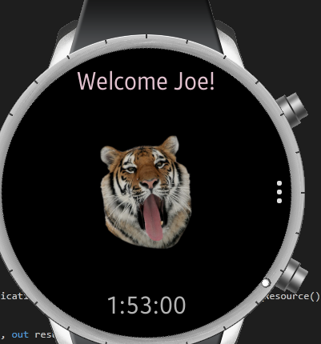


Now, if we click in that tiger, we will trigger a function that will get our previous values, build a string and use that as a key with an initial vector to decrypt the ***runtime.dll*** with AES, that is the image of our flag.


Trigger


Decrypt

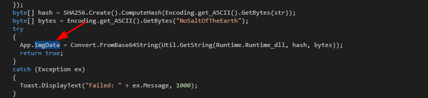


"Runtime.dll"

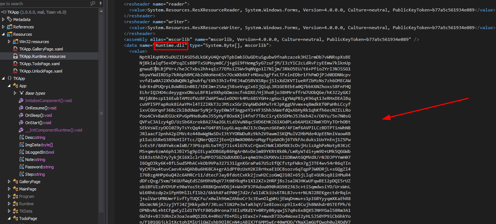


After that, just go to the gallery because the current image will be the flag.


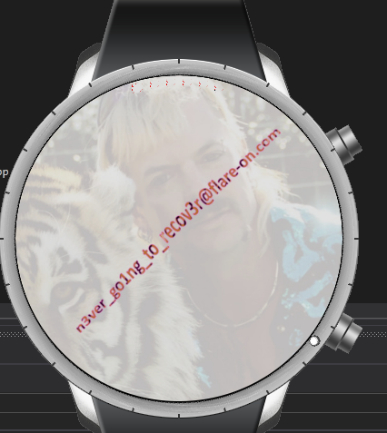


Very fun to beat this one, literally no big hack here it's just a matter to you to make Tizen tools works.


Tips:
* If you are doing that in a VM, disable GPU usage in the Tizen emulator configuration.


Thanks