# Code it - 6


Message:

```
Reverse engineer this little compiled script to figure out what you need to do to make it give you the flag (as a QR code).
```


So, in this challenge we must understand how this QR code generator works and be able to make it replace the content with the flag.


# Recon

Before I even started this challenge, by the name Code***it*** I imagined that has something to do with [AutoIT](https://www.autoitscript.com/site/), and guess so ? It has everything to do with AutoIT.

The file itself is compressed with UPX

> file codeit.exe                                     
codeit.exe: PE32 executable (GUI) Intel 80386, for MS Windows, UPX compressed

But, even this compressed file contain some data that indicate that we are dealing with an AutoIT compiled script, 

```
>> strings codeit.exe | grep AU3                    
$pAU3
H}AU3!EA06M
AU3!EA06T
```
***AU3!...*** it's like the magic number of compiled Autoit scripts, that has ***.au3*** extension.

## Running

So, the program works by receiving a text and creating a valid/authentic QR Code

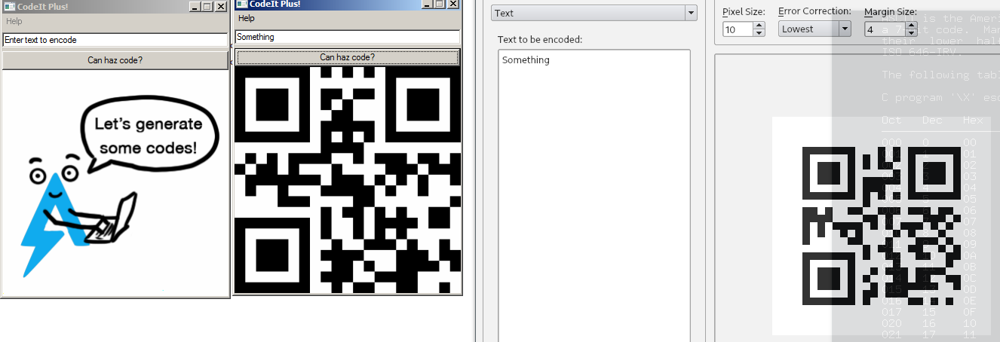


The first software has the initial screen and the second I put a word and generate a QR Code, the software I was using to read this images (that I printed) is [qtqr](https://github.com/pshpsh/qtqr).


So, at first look the software only do that.


# AutoIT extraction

The au3 script inside the autoit executable are compressed in the resource section, together with all the project files itself, I will use [AutoITExtractor](https://gitlab.com/x0r19x91/autoit-extractor) to retrieve all files associated with this project.


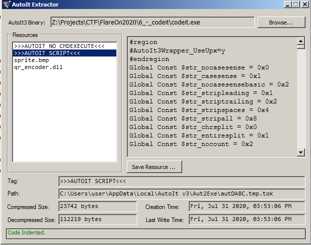


I extracted every piece of this project, ***sprite.bmp*** (The initial image), ***qr_encoder.dll*** a library that create qr codes, created by [Nayuki](https://www.nayuki.io/page/qr-code-generator-library0) and the script itself.


# The pain and the cure of obfuscation


The entire script is obfuscated, so it's almost impossible to read without a little strugle, but let's dig down into this obfuscation technique.


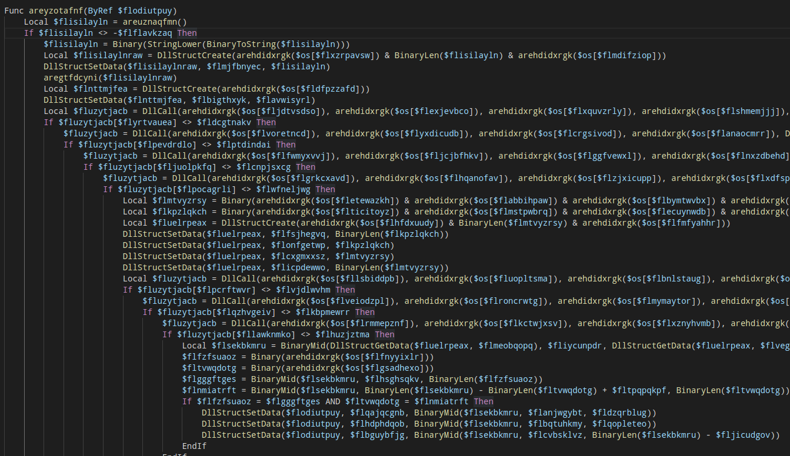


## The decode table


Before the program logic even starts, there is a global decode table that are created, denoted by the variable ***$os***, and the string values are encoded like:

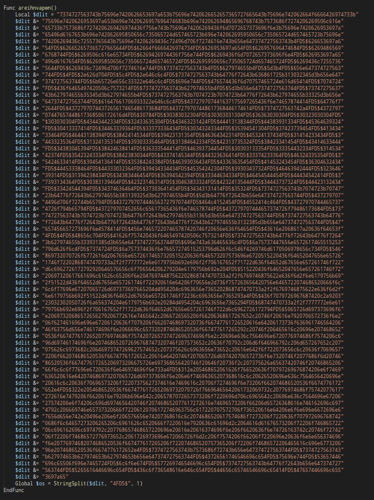


In order to pick all the program strings we just need to copy all this data and split by the word ***4FD5$***, I created a python decoder for that:

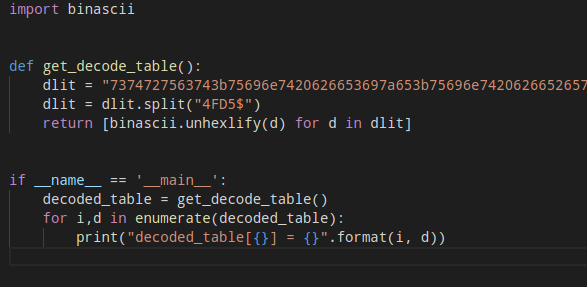


The idea here it's very simple, I just split the string and transformed this string in hex representation in his really value, that way I created the same table used by the script, and now I can see the real strings.

Some of the strings are below:

```
...
decoded_table[24] = b'kernel32.dll'
decoded_table[25] = b'int'
decoded_table[26] = b'GetComputerNameA'
decoded_table[27] = b'ptr'
decoded_table[28] = b'CodeIt Plus!'
decoded_table[29] = b'struct;byte['
decoded_table[30] = b'];endstruct'
decoded_table[31] = b'struct;byte[54];byte['
decoded_table[32] = b'struct;ptr;ptr;dword;byte[32];endstruct'
decoded_table[33] = b'advapi32.dll'
decoded_table[34] = b'CryptAcquireContextA'
decoded_table[35] = b'dword'
decoded_table[36] = b'CryptCreateHash'
decoded_table[37] = b'CryptHashData'
decoded_table[38] = b'struct*'
decoded_table[39] = b'CryptGetHashParam'
decoded_table[40] = b'0x'
decoded_table[41] = b'08020'
decoded_table[42] = b'00010'
decoded_table[43] = b'66000
...
```


But I don't stopped there, I need to at least make the code readable.


## The obfuscator algorithm


So the way that obfuscator is:

* It create a global decode table
* Its created a bunch of variable to represente numbers
* When some variable wants the string it will call the decode table with the index of the string
* The value will be send to a function that will do the job of ***unhexlify*** function

Example:

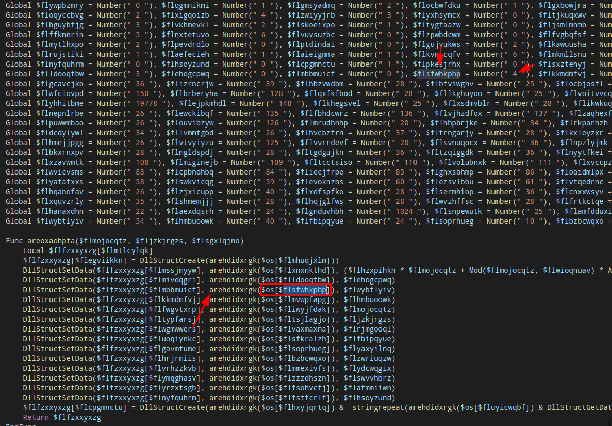

The function ***arehdidxrgk*** is the function that will decode the string, in this case, it's looking at the position ***4*** in the decode table, ***obs: In autoit/vbs the index starts at 1***, so in this case, it's looking the value ***'biSize'***.

## The deobfuscator algorithm

So, how I managed to defeat this obfuscation ? Doing all this at once!

* Create a regex rule to found all the ***Number(" \d+ ")*** ocurrences
* If it's the number is lower than the size of my decode table I save the variable name with the value
* Else I just hold the number value and the variable, because sometimes it wants just the number
* I now replace all ***$os[<variable>]*** by the value itself.

### Deobfuscator code

```python
def deobfuscate_content(content, decode_table):
    index_rule = r'Number\(\" \d+ \"\)'

    number_table = re.finditer(index_rule, content)
    decode_table_len = len(decode_table)
    tokens = {}

    # Find and classify tokens
    for number in number_table:
        real_number = int(number.group().split("\"")[1])
        
        if real_number != 0:
            real_number -= 1
        
        variable_name = content[number.start()-14:number.start()-3]
        
        if real_number >= decode_table_len:
            tokens[variable_name] = {
                'real_value': '',
                'number': str(real_number+1),
                'is_encoded': False
            }
            continue

        real_value = decode_table[real_number]
        tokens[variable_name] = {
            'real_value': real_value.decode(),
            'number': str(real_number+1),
            'is_encoded': True
        }

    # Replace the values
    for token, value in tokens.items():
        if value['is_encoded']: # If has a value in decode_table
            replace_var = "$os[{}]".format(token)
            content = content.replace(replace_var, '\"{}\"'.format(value['real_value']))
        
        content = content.replace(token, value['number'])


    return content        
    
```

The final code looks like:

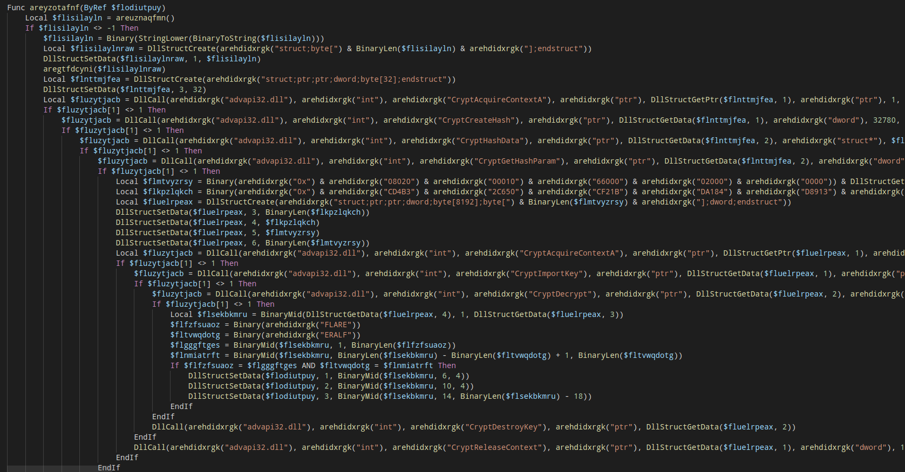

Now, let's start the real challenge, this is far from finish.


# What are that Windows crypto functions ?


You already have noticed that has come calls to ***CryptAcquireContextA*** and ***CryptDecrypt***, in order to AutoIT call this native functions it will use a special call called ***DllCall*** and the values must be created as an struct in memory with ***DllStructCreate***, this structures holds the same memory representation as this function will received if was called by the native code.


I recreated all this encryption part in C++, and it will be very easy to show what is happening here, because I already did all the dirty work to read each value in the struct passed and rebuild exactly the same call, if you don't have windows SDK, you can follow all this using the [wincrypt.h](https://github.com/wine-mirror/wine/blob/master/include/wincrypt.h) from wine,so let's in parts:


[CryptAcquireContextA](https://docs.microsoft.com/en-us/windows/win32/api/wincrypt/nf-wincrypt-cryptacquirecontexta) starts a new "encryption session" in Windows, using the handler we can access the crypto features, and this function must be called with the correct params that we want in our encryption.

```c
BOOL CryptAcquireContextA(
  HCRYPTPROV *phProv,
  LPCSTR     szContainer,
  LPCSTR     szProvider,
  DWORD      dwProvType,
  DWORD      dwFlags
);
```

```c
HCRYPTPROV cryptContext;
if (CryptAcquireContext(&cryptContext, NULL, NULL, PROV_RSA_AES, 4026531840)) {
    ...
}
```

So this will start a session that will use AES for RSA keys.


[CryptCreateHash](https://docs.microsoft.com/en-us/windows/win32/api/wincrypt/nf-wincrypt-cryptcreatehash) will start a new hash algorithm using the previous context, in this case:

```
BOOL CryptCreateHash(
  HCRYPTPROV hProv,
  ALG_ID     Algid,
  HCRYPTKEY  hKey,
  DWORD      dwFlags,
  HCRYPTHASH *phHash
);
```

```c
HCRYPTHASH hash;
CryptCreateHash(
    cryptContext,
    CALG_SHA_256, // 32780
    NULL,
    NULL,
    &hash);
```
Now it will use [CryptHashData](https://docs.microsoft.com/en-us/windows/win32/api/wincrypt/nf-wincrypt-crypthashdata) to hash the data from ***flisilaylnraw*** variable (I will back in this names too) and will retrieve the results with [CryptGetHashParam](https://docs.microsoft.com/en-us/windows/win32/api/wincrypt/nf-wincrypt-cryptgethashparam).


```c
BOOL CryptHashData(
  HCRYPTHASH hHash,
  const BYTE *pbData,
  DWORD      dwDataLen,
  DWORD      dwFlags
);
```

```c
BOOL CryptGetHashParam(
  HCRYPTHASH hHash,
  DWORD      dwParam,
  BYTE       *pbData,
  DWORD      *pdwDataLen,
  DWORD      dwFlags
);
```

```c
if (CryptHashData(hash, input, size, NULL) && CryptGetHashParam(hash, HP_HASHVAL, hashedData, &hashSize, NULL)){
    ...
}
```


Now, it will concat this value with another hex value:

```c
 0x08, 0x02, 0x00, 0x00, 0x10, 0x66, 0x00, 0x00, 0x20, 0x00, 0x00, 0x00 + <hashed_data>
```

This value, is actually a [PUBLICKEYSTRUC](https://docs.microsoft.com/en-us/windows/win32/api/wincrypt/ns-wincrypt-publickeystruc) that come when you export you created key by using [CryptExportKey](https://docs.microsoft.com/en-us/windows/win32/api/wincrypt/nf-wincrypt-cryptexportkey) function.

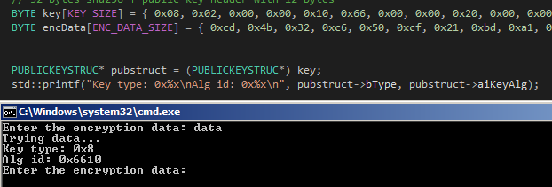


So, there is a bunch of encrypted data in this part, and the created key will be imported with [CryptImportKey](https://docs.microsoft.com/en-us/windows/win32/api/wincrypt/nf-wincrypt-cryptimportkey) function and later this encrypted data will be decrypted by [CryptDecrypt](https://docs.microsoft.com/en-us/windows/win32/api/wincrypt/nf-wincrypt-cryptdecrypt), if the decryption is sucessfully, our flag will be placed in our QRCode.


```
BOOL CryptImportKey(
  HCRYPTPROV hProv,
  const BYTE *pbData,
  DWORD      dwDataLen,
  HCRYPTKEY  hPubKey,
  DWORD      dwFlags,
  HCRYPTKEY  *phKey
);
```

```
BOOL CryptDecrypt(
  HCRYPTKEY  hKey,
  HCRYPTHASH hHash,
  BOOL       Final,
  DWORD      dwFlags,
  BYTE       *pbData,
  DWORD      *pdwDataLen
);
```


So, I created an entire decrypt system based in this algorithm, but guess so ? It's not the way to beat this challenge, but is fundamental to understand that part.

## The unused brute force function

```c++
bool decrypt(BYTE* candidate_password, int size)
{


	bool ok = false;
	HCRYPTPROV cryptContext;
	if (CryptAcquireContext(&cryptContext, NULL, NULL, PROV_RSA_AES, 4026531840)) {
		/// Context ok
		// 32 bytes sha256 + public key header with 12 bytes
		BYTE key[KEY_SIZE] = { 0x08, 0x02, 0x00, 0x00, 0x10, 0x66, 0x00, 0x00, 0x20, 0x00, 0x00, 0x00, }; // Partial key
		BYTE encData[ENC_DATA_SIZE] = { 0xcd, 0x4b, 0x32, 0xc6, 0x50, 0xcf, 0x21, 0xbd, 0xa1, 0x84, 0xd8, 0x91, 0x3e, 0x6f, 0x92, 0xa, 0x37, 0xa4, 0xf3, 0x96, 0x37, 0x36, 0xc0, 0x42, 0xc4, 0x59, 0xea, 0x7, 0xb7, 0x9e, 0xa4, 0x43, 0xff, 0xd1, 0x89, 0x8b, 0xae, 0x49, 0xb1, 0x15, 0xf6, 0xcb, 0x1e, 0x2a, 0x7c, 0x1a, 0xb3, 0xc4, 0xc2, 0x56, 0x12, 0xa5, 0x19, 0x3, 0x5f, 0x18, 0xfb, 0x3b, 0x17, 0x52, 0x8b, 0x3a, 0xec, 0xaf, 0x3d, 0x48, 0xe, 0x98, 0xbf, 0x8a, 0x63, 0x5d, 0xaf, 0x97, 0x4e, 0x0, 0x13, 0x53, 0x5d, 0x23, 0x1e, 0x4b, 0x75, 0xb2, 0xc3, 0x8b, 0x80, 0x4c, 0x7a, 0xe4, 0xd2, 0x66, 0xa3, 0x7b, 0x36, 0xf2, 0xc5, 0x55, 0xbf, 0x3a, 0x9e, 0xa6, 0xa5, 0x8b, 0xc8, 0xf9, 0x6, 0xcc, 0x66, 0x5e, 0xae, 0x2c, 0xe6, 0xf, 0x2c, 0xde, 0x38, 0xfd, 0x30, 0x26, 0x9c, 0xc4, 0xce, 0x5b, 0xb0, 0x90, 0x47, 0x2f, 0xf9, 0xbd, 0x26, 0xf9, 0x11, 0x9b, 0x8c, 0x48, 0x4f, 0xe6, 0x9e, 0xb9, 0x34, 0xf4, 0x3f, 0xee, 0xde, 0xdc, 0xeb, 0xa7, 0x91, 0x46, 0x8, 0x19, 0xfb, 0x21, 0xf1, 0xf, 0x83, 0x2b, 0x2a, 0x5d, 0x4d, 0x77, 0x2d, 0xb1, 0x2c, 0x3b, 0xed, 0x94, 0x7f, 0x6f, 0x70, 0x6a, 0xe4, 0x41, 0x1a, 0x52, };


		PUBLICKEYSTRUC* pubstruct = (PUBLICKEYSTRUC*) key;
		std::printf("Key type: 0x%x\nAlg id: 0x%x\n", pubstruct->bType, pubstruct->aiKeyAlg);


		HCRYPTHASH hash;
		CryptCreateHash(
			cryptContext,
			CALG_SHA_256, // 32780
			NULL,
			NULL,
			&hash);

		// Hash created
		const BYTE* userinput = (const BYTE*)candidate_password;
		BYTE hashedData[32];
		DWORD hashSize;

//		puts("Hashing value...");
		if (CryptHashData(hash, userinput, size, NULL) && CryptGetHashParam(hash, HP_HASHVAL, hashedData, &hashSize, NULL)){
			// sha256 hash
//			puts("Building the candidate private key...");
			for (auto i = 0; i < hashSize; ++i) {
				key[INITIAL_SIZE + i] = hashedData[i];
			}

			// Create 

			HCRYPTPROV decryptContext;
			HCRYPTKEY privKey;
			//puts("Importing key...");
			if (CryptAcquireContext(&decryptContext, NULL, NULL, 24, 4026531840) && CryptImportKey(decryptContext, key, KEY_SIZE, NULL, NULL, &privKey)) {
				puts("[+] Key imported! [+]\nStarting decryption...");
				for (auto i = 0; i < KEY_SIZE; ++i) {
					printf("%x", key[i]);
				}
				DWORD data_len;
				if (CryptDecrypt(privKey, hash, NULL, TRUE, encData, &data_len)) {
					puts("[+] Decrypted!! [+]");

					printf("Hex value: ");
					for (auto i = 0; i < ENC_DATA_SIZE; ++i) {
						printf("%x", encData[i]);
					}

					printf("Char value: ");
					for (auto i = 0; i < ENC_DATA_SIZE; ++i) {
						printf("%c", encData[i]);
					}
					
					printf("Key used: ");
					for (auto i = 0; i < KEY_SIZE; ++i) {
						printf("%x", key[i]);
					}
					ok = true;
				}
				printf("\n%d\n", GetLastError());
				CryptDestroyKey(privKey);
				CryptDestroyHash(hash);

			}
		}
	}
	return ok;
}
```


# The computer name


Later on I realized that my input was never sent to the encryption part, but was another value, this value was my computer name that the script gets my calling [GetComputerNameA](https://docs.microsoft.com/en-us/windows/win32/api/winbase/nf-winbase-getcomputernamea) function, then the name of my computer is passed to a function that will do a lot of operation up my computer name bytes and just after that, this decryption routine is called.


***obs: At this point I already renamed a lot of functions name, so it's very clean righ now***

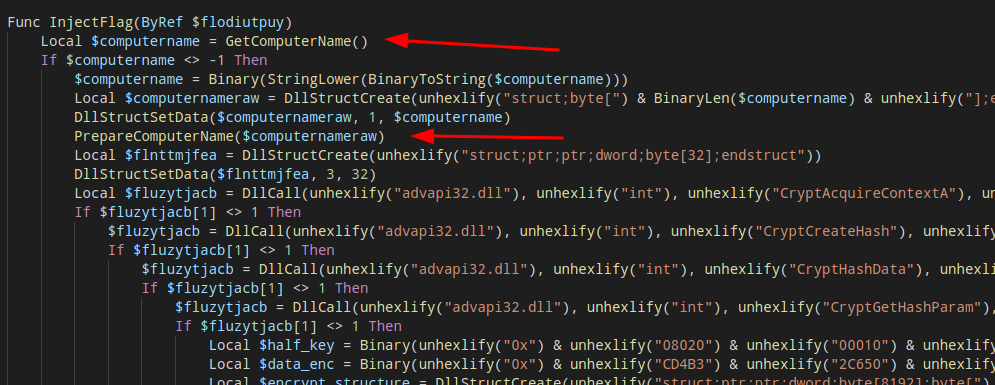

So, here my computer name is saved and then passed to a function that a called ***PrepareComputerName***


## The PrepareComputerName function

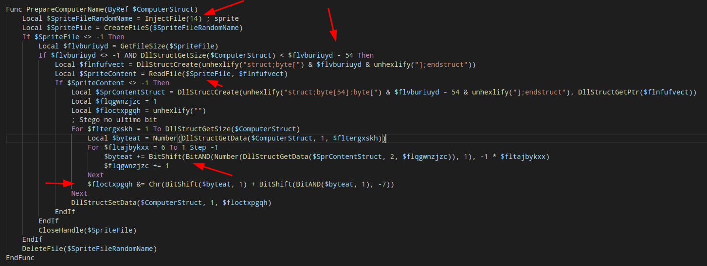


The key to beat this challenge is here, the script will load the ***sprite.bmp*** image and will see if it has some content after 54 bytes (After the bitmap header), and will start to loop in each of our computer name value and do the following steps:

Inside bitmap loop

* Read 6 bytes from the bitmap file
* For each byte it will check if has a [Least significant bit](https://en.wikipedia.org/wiki/Bit_numbering#Least_significant_bit)
* If has, it will be shift left this bit by the loop number it are righ now
* It will sum that to the current variable name

Out bitmap loop:
* It will remove the LSB
* Then will sum this value by 128 (1<<7)

What the **ck is this ? I don't picke-up 100% of this encoding technique, but the important part is, the key is actually encoded here, if we just ignore the fact that we are increasing the computer name byte and just get the encoded value in the bitmap, we will be able to recover the key. Because this function guarante that if the computername is wrong it will be changed by the encode schema.

I rewritten this routine to give us the key, and for better understanding:

```python
import sys
import hashlib

sprite_content = open("sprite.bmp", "rb").read()
hostname = [ord(x) for x in sys.argv[1].lower()]

sprite_content = sprite_content[54:] # Remove header

out = ""
count = 0
extracted = ""


flag = []
for i in range(len(hostname)):
	number_at = hostname[i]
	real_value = 0
	print("Picking {} ".format(number_at))
	for j in range(6, -1, -1):
		f = (sprite_content[count] & 1) << j
		print("({} & 1) << {} = {}".format(sprite_content[count], j, f))
		number_at += f
		real_value += f
		count += 1
	
	flag.append(chr(real_value))
	print("Result {}".format(number_at))

		
	sum_lsb = (number_at >> 1) + ((number_at & 1) << 7)
	print("Appling ({0} >> 1) + (({0} & 1)) << 7) = {1}".format(number_at, sum_lsb))
	out += chr(sum_lsb)


print(''.join(flag))
print(out)
print(' '.join([ hex(ord(o)) for o in out ]))
print(len(out))
```

If will run with any input and the bitmap, we will get the encoded value + the operation result value:

```
python3 decode.py THISISAVERYGO                                                                                                                                      
Picking 116 
(255 & 1) << 6 = 64
(255 & 1) << 5 = 32
(254 & 1) << 4 = 0
(254 & 1) << 3 = 0
(254 & 1) << 2 = 0
(254 & 1) << 1 = 0
(255 & 1) << 0 = 1
Result 213
Appling (213 >> 1) + ((213 & 1)) << 7) = 234
Picking 104 
(255 & 1) << 6 = 64
(255 & 1) << 5 = 32
(255 & 1) << 4 = 16
(254 & 1) << 3 = 0
(255 & 1) << 2 = 4
(254 & 1) << 1 = 0
(255 & 1) << 0 = 1
Result 221
....
aut01tfan1999
êîîÑMóãëéÑYPT
0xea 0xee 0xee 0xd1 0x4d 0xf3 0xe3 0xeb 0xe9 0xd1 0x59 0x50 0x54
13
```

The encoded value is ***aut01tfan1999*** if we pass this value as the input of this function, it will get the same as output:

```
...
Result 114
Appling (114 >> 1) + ((114 & 1)) << 7) = 57
aut01tfan1999
aut01tfan1999
0x61 0x75 0x74 0x30 0x31 0x74 0x66 0x61 0x6e 0x31 0x39 0x39 0x39
```

# Flag

Nice, we can now open the project in AutoIT editor and change the computer name or change our computer name and reboot.

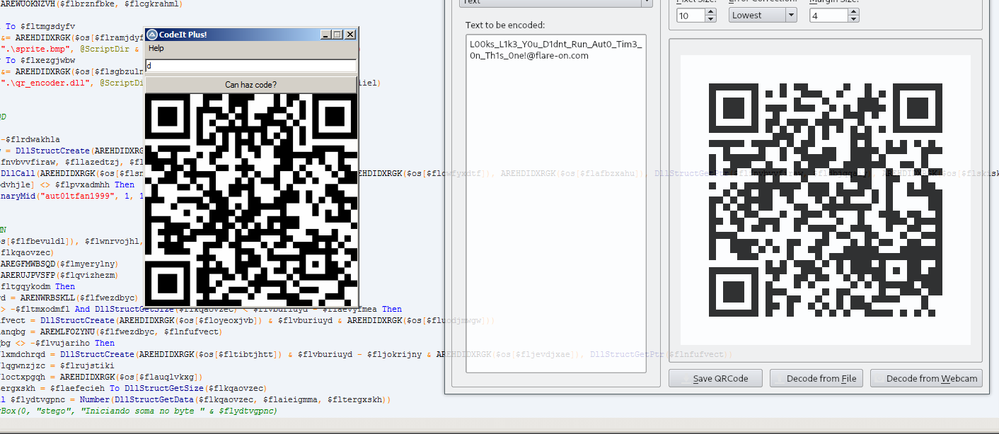


That one, was very hard to pick-up and I did a LOT of research in many topics, the resolution was far from what I was looking at the beginning, but still a very nice and amazing challenge!