# 8 - Aardvark

Message:

```
Expect difficulty running this one. I suggest investigating why each error is occuring. Or not, whatever. You do you.
```

Well, what can I say about this one... It was very frustrating to solve.


# Recon


## Windows diving into APUE
At first, It give to us a 64 bits PE file and like the message said before, it will not run at first, at least for me. I executed that file in a Windows 7 VM and I got this error:

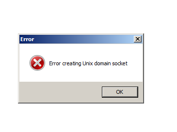


At first I realized that I need Windows 10 for this challenge, as it introduced support for [Unix sockets](https://devblogs.microsoft.com/commandline/af_unix-comes-to-windows/), this kind of socket is the most common used for [IPC](https://en.wikipedia.org/wiki/Inter-process_communication), it works by creating a [file descriptor](https://en.wikipedia.org/wiki/File_descriptor) that are used to communication between two parts. Another reason to install Windows 10 was the error that I provoke by ignoring the socket creation in x64dbg.

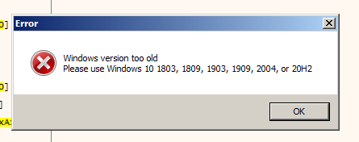


## At Windows 10


So, after a raw Windows 10 installation I got another error, at least the unix sockets worked, the error was:

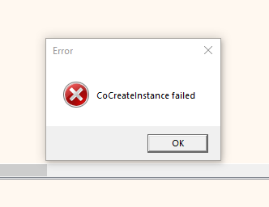


I was really stucked at this part, I search about this error and I found a lot of different solutions, but none of them looks the correct one for this challenge, after I while I just start debugging this PE trying to find something useful that may be causing this error.


## The strange case of the ELF inside PE


Later on, while I was debugging in x64dbg, I notice a function that drop a resource in the ***%temp%*** folder, take a look:

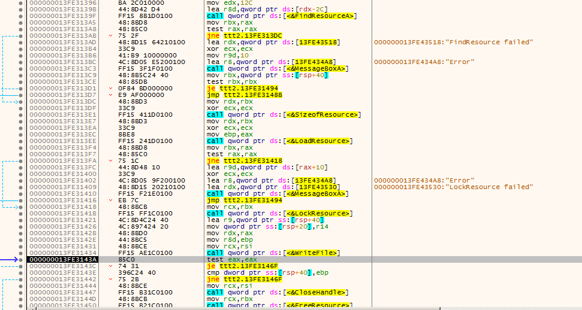

Notice that It calls the function [FindResouceA]() with the resource number ***0x12c*** (300), If you take a look at this the resources in this PE, you will notice something very odd.


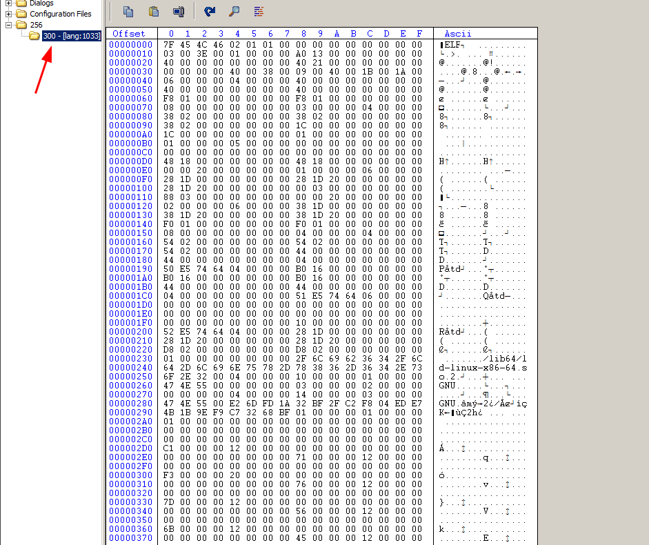


Wait a minute, what a ELF file is doing inside a PE ? if you open that ELF in any kind of static analysis tool ( I used [Cutter](https://cutter.re/)), you will notice that the main function of this ELF looks very like a client to this program, it has the ***connect***, ***send*** and ***recv*** function, and some kind of logic inside:


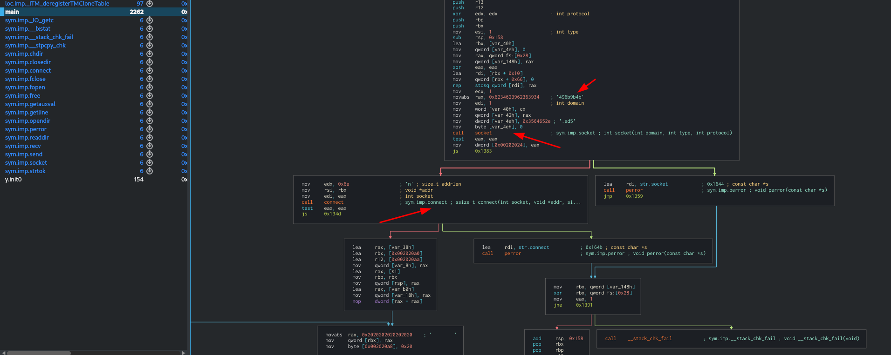


So, this is probably the client right ? But why the PE file drops this at temp folder ? 

It was not clear at first, but I had the idea to install [Windows subsystem Linux](https://docs.microsoft.com/en-us/windows/wsl/install-win10) with Ubuntu, and guess what ? That was the issue, the program was trying to execute this ELF file, and somehow this was messing with the COM objects, or something like that, after install the WSL, the program/game finally starts!


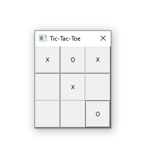


Yes, it's a Tic-Tac-Toe game, and it's against a simple IA that always win, really, it's impossible to win this game.

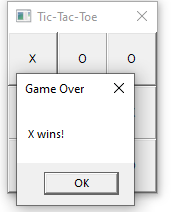


The maximum that you can get, is draw the game.


# Tic tac toe data struct


The way that the board is construct in code it's very simple, it takes a 9 bytes string and the first row is simbolized by the first 3 bytes and the second row from 3-6 and the last was the last 3 bytes.

>XXX000XXX

In another view:

```
XXX
000
XXX
```


The game starts with 9 spaces (0x20) in each program, after the first IA turn it will sync the string.


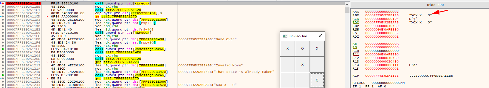


There is none logic in the server, I will only get the string, and send back. Does not matter if you change the string value at the program, the client has a built-in version of this structure and it will ignore anything that is different.


# Reversing the "IA"


In order to win this game, we must find a way that we can trick/patch the IA player in a way that we always win this game.


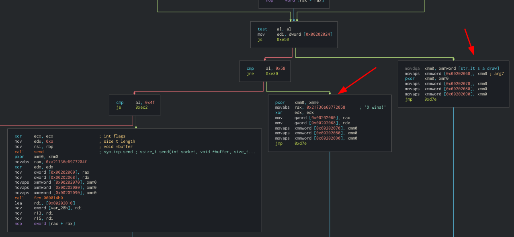

So yeah, we can just patch this ***jne*** here, right ? ***wrong***

Doing this unique patch just create a bug and make everything blank, I just patched the ELF file using Cutter and replaced the PE resouce using [Resource Hacker](http://angusj.com/resourcehacker/).


## The wrong result

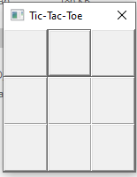

As you can see, we can't just patch this instruction, not only this instruction. Later on by reversing the client, I realized that I need at least start the game for the client variables be correctly initiliaze, by doing that patch we just mess everything, take a look at the first part of the game logic:


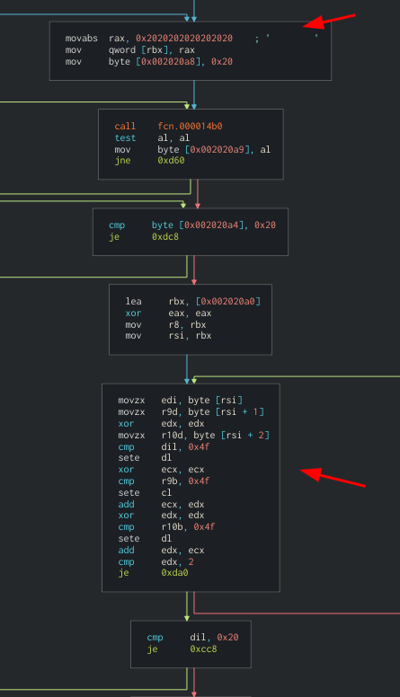


The client actually starts a 8 bytes long string with spaces, so the trick here is just start the string In a way that we just need to do one move and win, for the program we still will be playing, but for the client it will be the end.


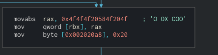


Now we just replace the resouce and...


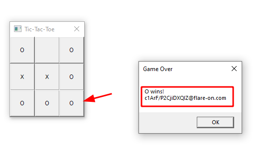


So yeah, the flag is this weird random string, I lost 2-3 hours looking for something else because this ***doesn't*** look to any flag format that we have seen so far, this is literally a ***random string***.


That was really frustrating, the challenge itself was very fun to solve but this random flag really disappointed me, at the end we still found something useful in this challenge, It was the first time that I see a usage of WSL for some Windows application.