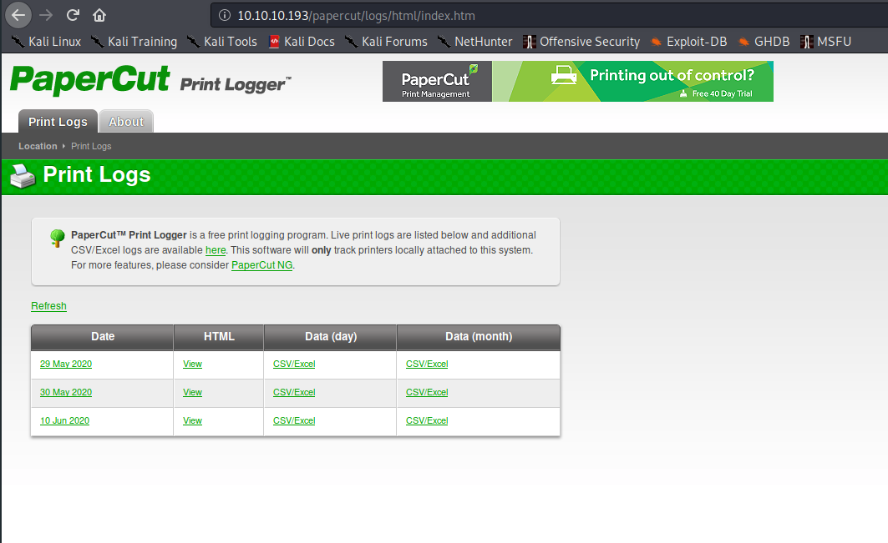
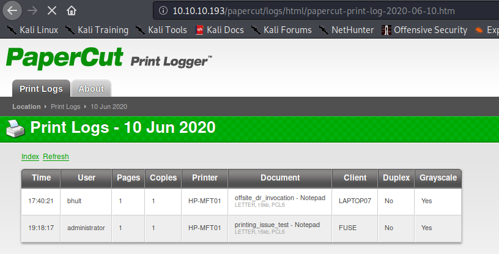

# Fuse - 30 points (Medium)
## Unfinished write-up :p

## Basic recon

Without run any tool, almost always there is a HTTP Server running, so let's first go to the machine address, for me http://10.10.10.193

When we access the url, we are redirect to http://fuse.fabricorp.local/papercut/logs/html/index.htm, but as our machine don't know what hostname it's, we can just change to the target ip (This is just a root redirection to the target application).

### Papercut logs

This system logs all printer logs, in each of this log links, we can find a username that printed something. Example:

So, here is the my users.txt that I retrieved in this page:

* pmerton
* tlavel
* sthompson
* bhult
* administrator

## Looking for Windows services

So, before continue let's run a quick scan for known Windows services that we can explore:

