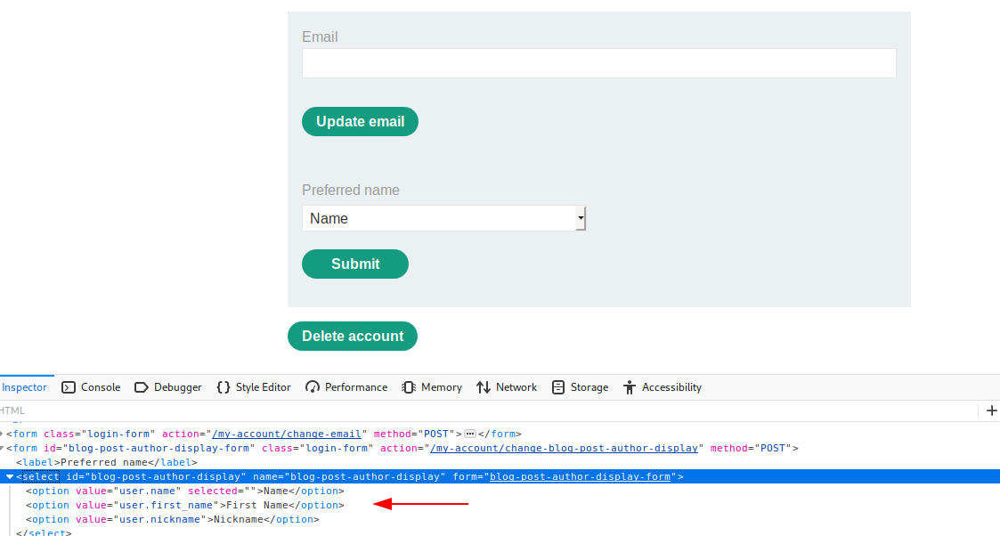
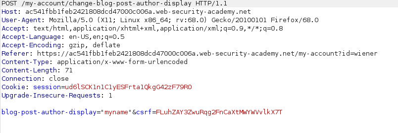
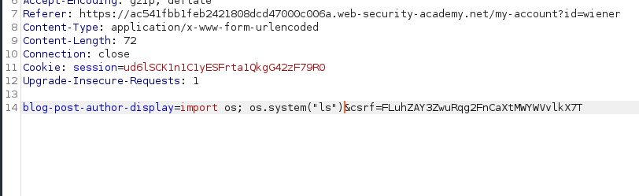
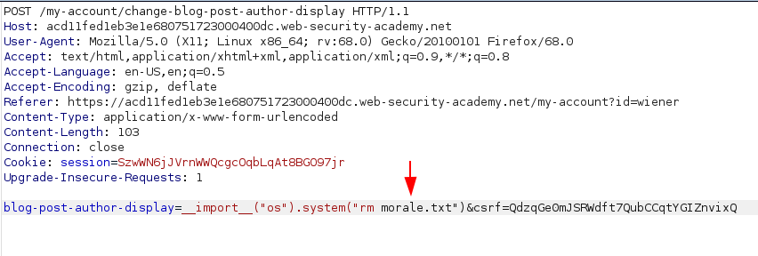

# Lab 02 Basic server-side template injection (code context)


That one was very trick, when you access the lab you can view some blogposts and comments, in the lab description you have a username and a password for your user. Inside your "My Account" page you have the field "Preferred name" if you take a look in the form values, you have:




You can see that this are actually inside Python variables, so you can change that for any value that is some kind of string, so using burp we cant modify our requests like:




This will make our username in comments appear "myname", so let's try make RCE, my first try was:



Of course this don't worked, because this is actually passed as a argument in the generate function in Tornado template. So after a couple hours researching about this template system and ways to make dynamic import in python, i found that actually the ***import*** command in python is a friendly interface from the ***\_\_import\_\_*** function:

```python
import os
os.system("id")
```
Is the same as
```python
os = __import__("os")
os.system("id")
```

So yeah, we can make our one liner RCE with this!




And boom, you beat the lab! reading the lab description the solution explore the Tornado template injection, its also a more verbose way to do, and gives you more power to code, but i found my solution very trick, so i let this one :).