# Worker

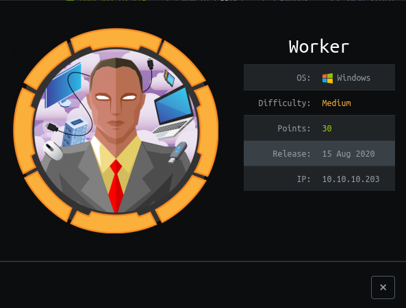


Worker it's a machine that explore a exposed SVN server and exploitable Devops enviroments.


IP: 10.10.10.203

## Recon

If we try to access the IP directly in the browser, we will get a IIS default page:

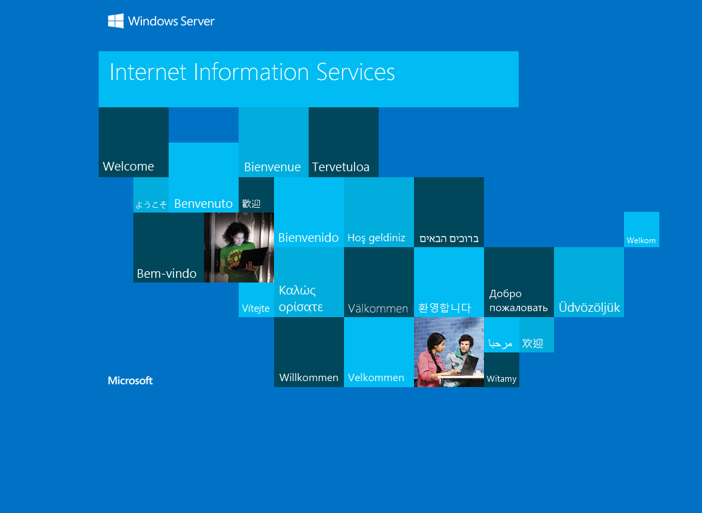

We can't really do much just with this static webpage, the first step it's enumerate all possible service that we can at first exploit somehow.


>nmap 10.10.10.203 -sV -A -p-10000

```
Starting Nmap 7.91 ( https://nmap.org ) at 2021-01-03 19:40 EST
Nmap scan report for 10.10.10.203
Host is up (0.31s latency).
Not shown: 9997 filtered ports
PORT     STATE SERVICE  VERSION
80/tcp   open  http     Microsoft IIS httpd 10.0
| http-methods: 
|_  Potentially risky methods: TRACE
|_http-server-header: Microsoft-IIS/10.0
|_http-title: IIS Windows Server
3690/tcp open  svnserve Subversion
5985/tcp open  http     Mcaticrosoft HTTPAPI httpd 2.0 (SSDP/UPnP)
|_http-server-header: Microsoft-HTTPAPI/2.0
|_http-title: Not Found
Service Info: OS: Windows; CPE: cpe:/o:microsoft:windows
```

It's a good choice to run nmap in the first 10k ports, because Windows use a lot of upper ports (By default, nmap only scan the first 1000), looking at the result we found something very different than usual:

* Subversion server
* WinRM service

If you never used ***svn*** before, it's a VCS (Version control system), just like ***git***, it's very less used than git but still used.

## Querying SVN Server

SVN works with the concepts of directories and repository, we can try impersionate this server to see if there is any exposed information about the server itself:

>svn info svn://10.10.10.203
```
Path: .
URL: svn://10.10.10.203
Relative URL: ^/
Repository Root: svn://10.10.10.203
Repository UUID: 2fc74c5a-bc59-0744-a2cd-8b7d1d07c9a1
Revision: 5
Node Kind: directory
Last Changed Author: nathen
Last Changed Rev: 5
Last Changed Date: 2020-06-20 09:52:00 -0400 (Sat, 20 Jun 2020)
```

At first, this looks like a exposed server, with this we can list all this directory files and, if we have lucky, download all the repository and version control information.


>svn ls svn://10.10.10.203
```
dimension.worker.htb/
moved.txt
```
Very good, we can at least ***list*** everything, we can go further and get all the ***revisions log*** (just like the commit history), to see if we have any useful message.

>svn log -v svn://10.10.10.203/
```
------------------------------------------------------------------------
r5 | nathen | 2020-06-20 09:52:00 -0400 (Sat, 20 Jun 2020) | 1 line
Changed paths:
   A /moved.txt

Added note that repo has been migrated
------------------------------------------------------------------------
r4 | nathen | 2020-06-20 09:50:20 -0400 (Sat, 20 Jun 2020) | 1 line
Changed paths:
   D /deploy.ps1

Moving this repo to our new devops server which will handle the deployment for us
------------------------------------------------------------------------
r3 | nathen | 2020-06-20 09:46:19 -0400 (Sat, 20 Jun 2020) | 1 line
Changed paths:
   M /deploy.ps1

-
------------------------------------------------------------------------
r2 | nathen | 2020-06-20 09:45:16 -0400 (Sat, 20 Jun 2020) | 1 line
Changed paths:
   A /deploy.ps1

Added deployment script
------------------------------------------------------------------------
r1 | nathen | 2020-06-20 09:43:43 -0400 (Sat, 20 Jun 2020) | 1 line
```

Notice that at reversion ***2*** an powershell script was created and at revision 4 this file was deleted, so we just need to download the source code and go back in time until this file exists.

>svn checkout svn://10.10.10.203

Now that we have the source code, let's just read the ***moved.txt*** file before go back in time:

>cat moved.txt
```
This repository has been migrated and will no longer be maintaned here.
You can find the latest version at: http://devops.worker.htb

// The Worker team :)
```

As HTB don't have a DNS server for us to use, I imagine that this is probably running in the same machine using [Virtual Hosts](https://en.wikipedia.org/wiki/Virtual_hosting), so I just added this entry in ***/etc/hosts***

```
10.10.10.203 devops.worker.htb
```

Ok, let's back in time and get this powershell script:

>svn up -r2

This tells to svn update the current repository to the ***revision*** 2. Now we can get the file content:

>cat deploy.ps1

```powershell
$user = "nathen" 
$plain = "wendel98"
$pwd = ($plain | ConvertTo-SecureString)
$Credential = New-Object System.Management.Automation.PSCredential $user, $pwd
$args = "Copy-Site.ps1"
Start-Process powershell.exe -Credential $Credential -ArgumentList ("-file $args")
```
* User: ***nathen***
* Pass: ***wendel98***

We get the username and the password for the ***nathen*** user!

### Failing trying WinRM 

At first, I just imagine that this is the porpuse of this winrm server running, right? but unfortunaly we are unable to login using this creds, the user could have changed or has no remote access permission:

>evil-winrm -i 10.10.10.203 -u nathen -p wendel98
```
Evil-WinRM shell v2.3

Info: Establishing connection to remote endpoint

Error: An error of type WinRM::WinRMAuthorizationError happened, message is WinRM::WinRMAuthorizationError

Error: Exiting with code 1
```


## Enter Azure Devops

Remember the Devops page that their moved their project ? It's actually [Azure Devops](https://azure.microsoft.com/en-us/services/devops/?nav=min) a full enviroment for developers create and manage their project using agile and integrate their code with pipelines.


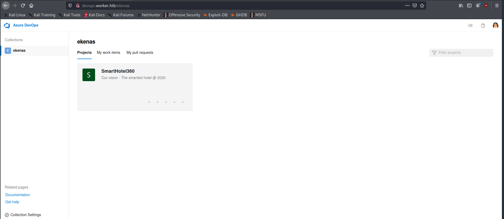

When we open the page will be prompt for credentials, that's where the ***nathen*** creds will be used, we successfully logged in the platform, here we can look at their projects, repositories and pipelines.

The key to solve is, pipelines, pipelines do something using the repository so I just take a look and found a useful CI pipeline to deploy all the repo merge to master, into production.

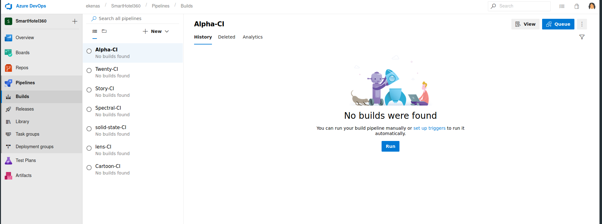

If you just hit the ***Run*** button, we will see all the pipelines steps:

* Clone the master code
* Copy all the page to the IIS server path

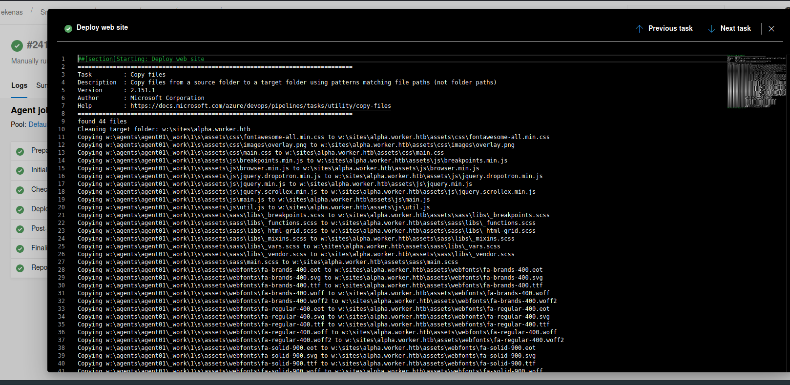


So here is my idea:

* Upload a web shell to the master branch
* Trigger the pipeline to deploy our webshell
* Run the webshell as a entrypoint


To achieve this, you must follow the project rules that are:

* Direct master commits are not permited
* At least one reviewer
* At least one linked work (task)


I created a branch called ***dev***, picked some [random](https://raw.githubusercontent.com/tennc/webshell/master/fuzzdb-webshell/asp/cmd.aspx) ***aspx*** webshell (because this is a IIS server and the Metasploit payload doesn't work)

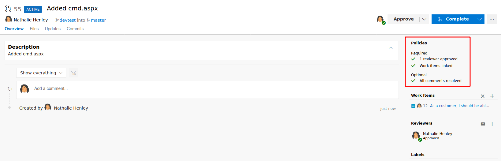

After that, the pipelines ***Alpha CI*** started and our webshell was deployed, this website is at ***http://alpha.worker.htb***, so I added that host at my ***/etc/hosts*** too.

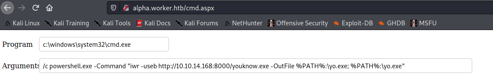

### Exploiting

Ok, after the webshell uploaded we can download our classic ***meterpreter*** payload and execute in the machine.

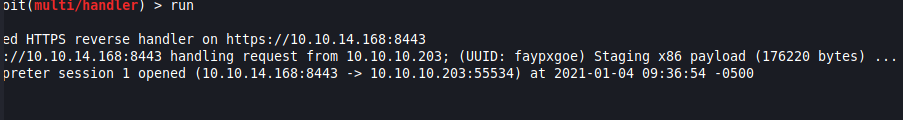


***neato***


### Two flags at once

As we start as an IIS process, our current user is a service user, and we can't do much.

After a lot of time wasted on this server, I decided to check all the disks that are currently in the machine, because at the pipeline screen I saw something being copied from the disk ***W***

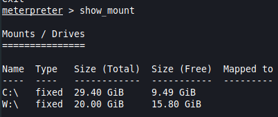

In the W disk, there is all the SVN files and the Azure devops agent files, looking at the SVN folder, ***W:\svnrepos\www\conf>***, I've found a file called passwds with contains a lot of users:password entries:

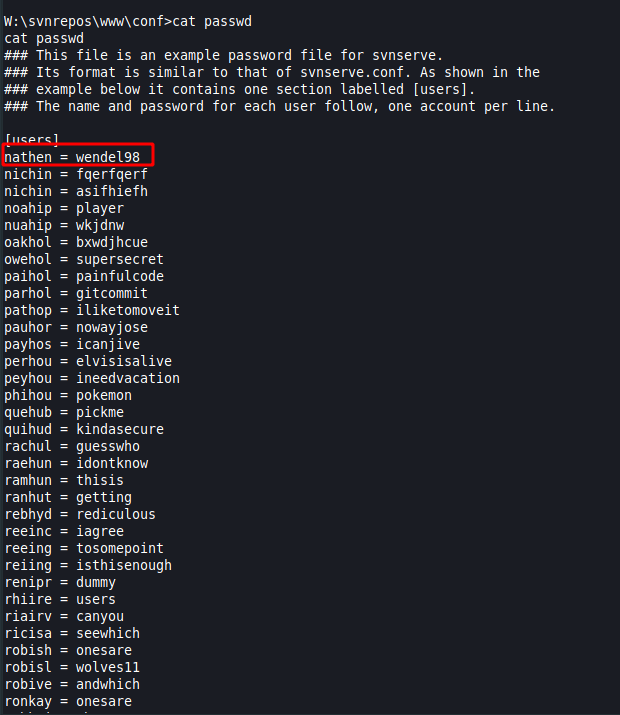

Notice that the ***nathen*** are acuatlly here, and if we run ***net user*** command, we will see a LOT of users created on this machine, so this is probably created to confuse us and make us seek the correct user to root the machine, easy, we just need to get the users that are currently in the Administrators group

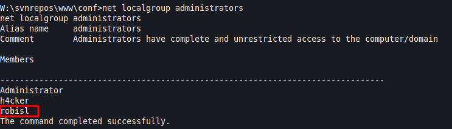


For our lucky, there is a valid user here (don't know if this h4cker was there or someone created somehow), this user is in the passwds files:

>robisl = wolves11


### Enter WinRM

Now we can try to access the machine again using WinRM, maybe we will have more lucky now...

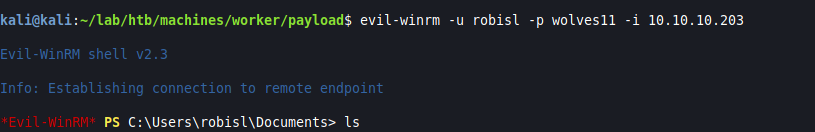


***Just works***

We won, right? Yes :) 

The user flag is at the ***robisl*** home folder

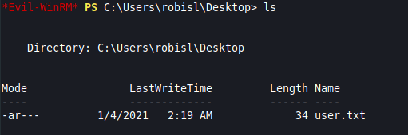

And the root flag is at the ***Administrator*** folder, as usual:

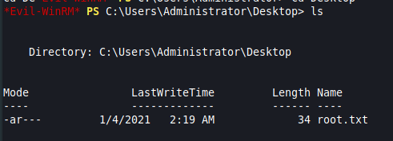


## Conclusion

That machine was very fun to solve, I liked how we exploited their infrastructure using their devops tools, this could be avoided in real life if we had more enforcement in the merge policies, in a real world scenario there must be more than 1 person reviewing the code, but we now that is not the case in some places. 

Thanks