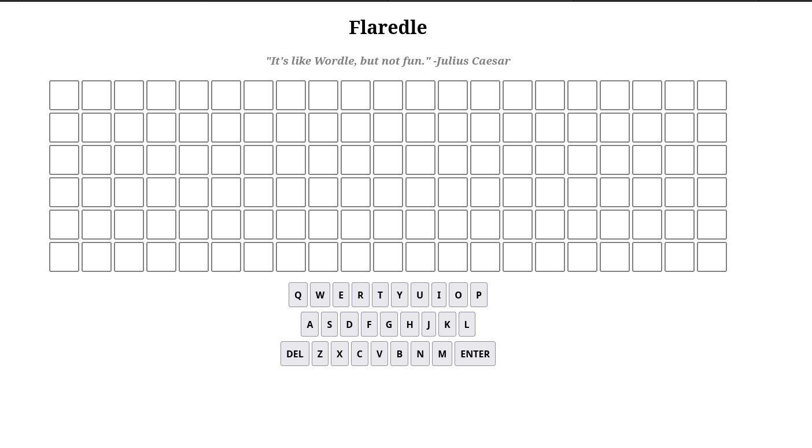

#  01 - Flaredle 


## Description:


```
Welcome to Flare-On 9!

You probably won't win. Maybe you're like us and spent the year playing Wordle. We made our own version that is too hard to beat without cheating.

Play it live at: http://flare-on.com/flaredle/
```

## Solving


This is a very simple challenge, at first you will have a virtual keyboard:



Here you have to type something, but we don't need spend time here.

If you look at the source code you will see a javascript called `script.js` with some cool stuff:


```javascript
import { WORDS } from "./words.js";

const NUMBER_OF_GUESSES = 6;
const WORD_LENGTH = 21;
const CORRECT_GUESS = 57;
let guessesRemaining = NUMBER_OF_GUESSES;
let currentGuess = [];
let nextLetter = 0;
let rightGuessString = WORDS[CORRECT_GUESS];
```

Then a few functions latter:

```javascript
   if (guessString === rightGuessString) {
		let flag = rightGuessString + '@flare-on.com';
		toastr.options.timeOut = 0;
		toastr.options.onclick = function() {alert(flag);}
        toastr.success('You guessed right! The flag is ' + flag);

        guessesRemaining = 0
        return
    }
```

So we just need to look for the `rightGuessString`, which is ***WORDS[CORRECT_GUESS];***, the `CORRECT_GUESS` variable is *57*, and the `WORDS` it's a big string array:

```javascript
export const WORDS = ['acetylphenylhydrazine',
	'aerobacteriologically',
	'alkylbenzenesulfonate',
	'aminoacetophenetidine',
	'anatomicopathological',
	'anemometrographically',
	'anthropoclimatologist',
	'anthropomorphological',
	'anticonstitutionalism',
	'anticonstitutionalist',
    ...
```


In order to solve quickly, just copy this array into Python and type:

```
>>> WORDS[57] + '@flare-on.com'
'flareonisallaboutcats@flare-on.com'
```

That's all, the first challenge is always easy.

