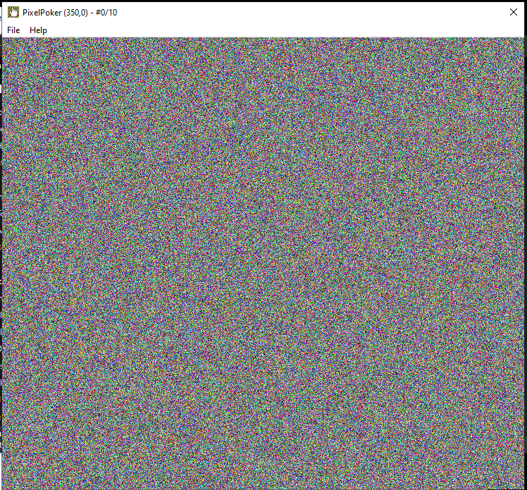
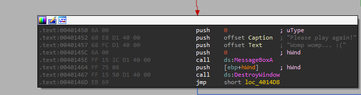
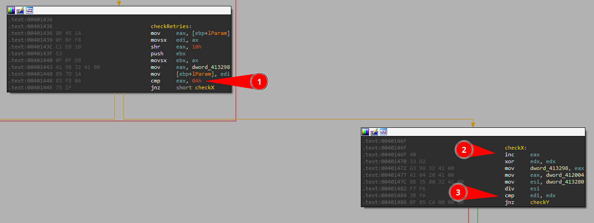
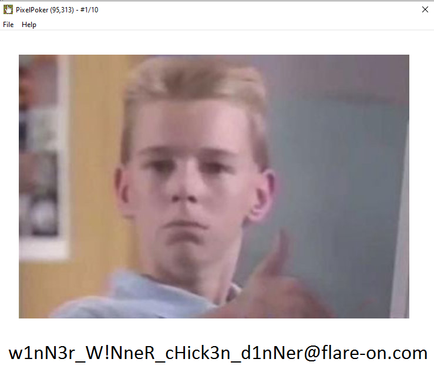

# 02 - Pixel Poker 


## Description

```
I said you wouldn't win that last one. I lied. The last challenge was basically a captcha. Now the real work begins. Shall we play another game?
```


## Overview

In this challenge we need to guess the right pixel in the screen to reveal the flag:




So probably clicking everywhere is not a good way to beat this challenge, and you only have `10 retries`.


## Getting straight into check logic:


If you click 10 times or more, you will get into a error screen:


So we can use this string, to easily go into check pixel check (X, y) and see what we must do in order to proceed!





Good, now we can easily follow the *red* arrow to find in what situation we hit this basic block:


## Initial check




We can see at *01* that is compared if eax is equal to 10, so here is where the guess count starts, then after that if we still good to go, it's incremented at *02*, then some values are moved and our input that is in `edi` is compared to `edx`, we can  check in details on `x32dbg`:


So at **01** here I picked the coordenates (397, 113), and you can see that their are in hex are ***0x18D*** and ***0x71*** respectively.

Now it's easy to verify that `EDI` (*03*) holds the same values of our X coordenate, notice that I also put the breakpoint in the `div esi` instruction, because here is where the juicy part is.


If you check the previous image, you will notice that some value is loaded at `eax` and `esi`, in the `checkX` basic block they are: *0x52414C46* and `0x2E5` (*04* and *05*).

The `div` instruction divide the value of `eax` with the operand of the instruction, in our case `esi`, and saves te remains inside the `edx`, if you notice in the next instruction it will be compared our input with the remaining of this operation, so:

```
X = 0x52414C46 % 0x2E5 
X = 95 (Decimal)
```

Nice! So, now we just need to follow until the next block that will check the Y coordenate:


It's the same idea, we move a value into `eax` (*01*) then divide by the `Y` coordenate (*02*) and we compare the remainder 

The value that `eax` have in the address `0x412008` is `0x6E4F2D45`:


And the remainder that will be compared are:


In other words, our Y must be:

```
ecx = 0x281
Y = 0x6E4F2D45 % ecx
Y = 313
```


So our X,y are (95, 313)! Let's test it:

## Testing




That's it.