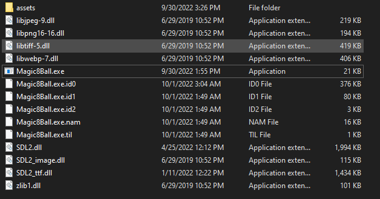

# 03 - Ball 8


## Description:

```
You got a question? Ask the 8 ball!
```

## Introduction

The challenge is a question game, you ask something to the ball and it will answer:


You can also shake the ball with the arrow keys of your keyboard, this will be important!

##  Reversing - Finding the game loop

At first, we can notice that the game is written using [SDL](https://www.libsdl.org/), a pretty good library to work with multimedia (graphics, audio, input and so on), it's easy to notice because it comes with all the libraries inside the package:




If you ever play with this library, you know that you will need to call functions like `SDL_Init` to start the SDL context, also everything in SDL will most likely run in the famous "game loop" where at each "tick" it will pull user inputs and process, so we can easily find the game logic just by looking for the `SDL_Delay` call, because as the loop run fast than the user, the `SDL_Delay` "limit the FPS", so we can just look for this in a tool like IDA and just for it cross reference:


Then following the reference:


So here you can see the game loop where everything is going to be processed! 

***You may also noticed that my image base address is different from the file, that's why when I was debugging inside the x32dbg the address was the not the image base one, so I needed to rebase inside IDA***

## Guessing the win situation

Sometimes in RE activities, we deduce what can be happening inside the program based on intuition and practice, that was what happened to me when I was looking inside the `sub_4024E0` routine, where it's a big routine:


But we can notice that have very exclusive conditions here that if fail, it will exit the program, we can impersonate easily:


Notice that something is being compared with `L`, and later on there is more compare inside this buffer to other letters:


At this point I got it, this was directions:

* L -> Left
* U -> Up
* R -> Right
* D -> Down

If we look close in all compare in sequence we will have the following moves: `LLURULDUL`, so it's easy to understand that we must shake the ball in this sequence!

Then after "move" is correct, there is a string compare to something:\


And we can easily check what is inside the debugger:


I almost got the string in the first time, my input was ***give me flag plssssss?***, so close!


## Beating


So in order to win, you just need to shake the ball with the arrow keys in that sequence, and ask for this question! 


Simple as that!

It's always good when a [beginner](https://github.com/AandersonL/Chrono-Trigger-C) project help to solve complex problems!.